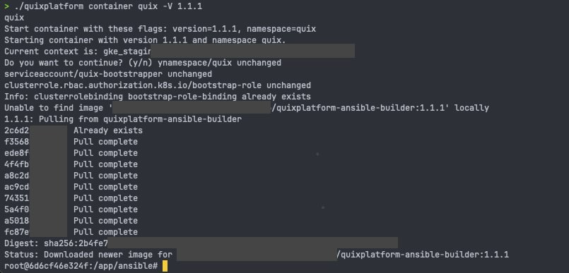

# How to install BYOC

The summary of the deployment procedure is as follows:

1. Create a [Kubernetes cluster](#1-create-a-kubernetes-cluster)
2. Obtain a Quix Container Registry [API key](#2-obtain-an-api-key-to-pull-quix-platform-containers) to pull Quix Platform containers
3. Obtain a copy of the Quix Platform [BYOC installer](#3-obtain-a-copy-of-the-quix-platform-byoc-installer-ansible-recipe--docker-image) (Ansible Recipe + Docker Image)
4. [Prepare Secrets](#4-prepare-secrets-and-platform-configuration) and platform configuration
5. Run the [installer container](#5-run-the-installer-container)
6. [Push Secrets](#6-push-secrets-and-platform-configuration-to-the-cluster) and platform configuration to the cluster
7. Optional: [Initialize ArgoCD](#7-optional-initialize-argocd)
8. [Install Quix Platform](#8-install-quix-platform) for the first time

This is explained in more detail in the following step-by-step guide.

## 1. Create a Kubernetes cluster

This step is where you have the most freedom of choice. The assumption this guide works with is that you have an operational Kubernetes cluster ready to schedule pods and create the requirement dependencies. Any Kubernetes installation should work as long as it clears the requirements in the [Requirements](requirements.md) section.

In short, if your Kubernetes cluster configuration isn't _particularly_ niche, it should work without any extra configuration.

Quix recommends a production ready Kubernetes cluster, with HA control plane and multiple worker nodes, as this makes maintenance and scaling easier.

## 2. Obtain an API key to pull Quix Platform containers

In this step you will be receiving a username / API token and docker registry URL. These will be provided to you by Quix before you start the installation process.

&nbsp;&nbsp;&nbsp;&nbsp;[Contact sales](https://share.hsforms.com/1iW0TmZzKQMChk0lxd_tGiw4yjw2)

## 3. Obtain a copy of the Quix Platform BYOC installer (Ansible Recipe + Docker Image)

With the provided API key you can download the installer from our private Container Registry. The installer is a Docker image that contains an Ansible recipe and all the required dependencies to run it. This way you don't need to install Ansible (and its particular Python version dependencies), Helm and all the other programs and libraries required to run the installer. We have packaged it all to offer a turn-key, convenient experience.

## 4. Prepare Secrets and platform configuration

A successful installation of the Quix Platform requires a few secrets and variables to be set. Secrets are used to store sensitive information about your Platform Installation. API keys, usernames, passwords for all the services, dependencies and integrations are stored in Secrets which the Installer will use to configure the Platform. By storing secrets in a Kubernetes native way we ensure that any subsequent successful installations of the Quix Platform do not depend on the machine used for installation. After a successful initialisation of the Secrets and Platform configuration, anyone with the correct permissions should be able to maintain the platform.

If ArgoCD is used -- of which we supply an opinionated installation, if you choose to use it --, it will be able to utilize these secrets and configuration to maintain the platform.

## 5. Run the installer container

The container is built and tested with Docker. On any system capable of running Docker, you can run the installer with the following command:

```bash
./quixplatform container quix -V 1.1.2
```

This will run the Quix Platform Installer using the Quix Platform CLI tool provided to you ahead of the installation process. 

{width=80%}

## 6. Push Secrets and platform configuration to the cluster

The Quixplatform CLI tools help you push the Secrets and Platform configuration to the cluster.

1. Ensure you have everything set correctly in `vars/platform-variables.yaml` and `vars/platform-secrets-human.yaml`

Then, from inside the Installer container started in step 4, run the following command:

```bash
namespace=quix
./secrets.sh init vars/platform-secrets-human.yaml.template vars/platform-secrets-human.yaml
# Add your secrets to vars/platform-secrets-human.yaml
./secrets.sh encode vars/platform-secrets-human.yaml vars/platform-secrets.yaml
./secrets.sh push ${namespace} vars/platform-secrets.yaml
./quixplatform config ${namespace} -f vars/platform-variables.yaml
```
As a general rule, commands and steps are designed to be idempotent wherever possible. This is also the case when manipulating secrets and platform configuration:
any subsequent pushes that make no changes will look like this: 
{width=80%}

## 7. Optional: Initialize ArgoCD

Run the following commands inside the installer container:

Change values in `init-scripts/application.yaml.template` to meet your requirements.
The following lines are of particular interest:

```yaml
    repoURL: ''
    targetRevision: stable
    path: releases/
```

These define what release 'stream' your environment is subscribed to. When running ArgoCD connected to our release branches, any updates we deploy to the repository your environment follows will be automatically applied, based on GitOps principles. There's a [little more to it](release-filtering.md), but generally speaking your environment will deploy the latest version of the platform, unless you specify otherwise.

Any software package we release for the BYOC offering will have been put through our QA process and validated. That said, we operate multiple external branches to facilitate testing leading-edge features on your test environments before we add them to the stable branch.

```bash
argo_namespace=argo
quix_namespace=quix
init-scripts/init.sh ${argo_namespace} ${quix_namespace}
```

This will initialize ArgoCD and create the Quix application in the namespace you specify. If you do not specify a namespace, it will default to `argocd` and `quix`.

!!! tip
    You may host your own release repository to subscribe to with ArgoCD. This allows you to be in ultimate control of the entire release process.

## 8. Install Quix Platform

Inside the installer container, run the following command:

```bash
./quixplatform install
```

or if ArgoCD is installed, but you want to manually trigger the installation:

```bash
./quixplatform install --context=<your_kubectl_context_name>
```

This installs Quix on your Kubernetes cluster. The installation process will take three to five minutes. 

The progress of the installation is displayed as Ansible roles initialize and set up the various components and then the Quix Platform itself, as shown in the following screenshot:

{width=80%}
