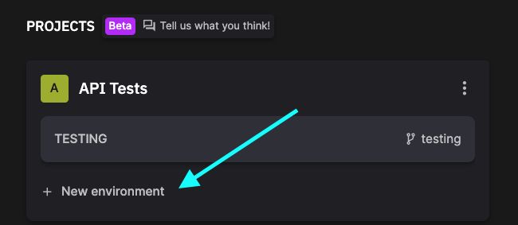

# Create an environment

When you [create a project](create-project.md), you'll need to create at least one environment. This page describes how to create an environment in more detail.

## Watch a video

<iframe src="https://www.loom.com/embed/877ae703f0cf458f8827341549adce6c?sid=a1fed45f-b4a2-4442-8d9e-c981b6286fcb" frameborder="0" webkitallowfullscreen mozallowfullscreen allowfullscreen style="position: absolute; top: 0; left: 0; width: 100%; height: 100%;"></iframe>

??? "Transcript"

    0:01 Hi, welcome back. In this video I'll show you how to create an additional environment. In the last video you went through the creation of a project and the first environment.

    0:15 If you remember we created the production environment which corresponds to the first environment. We're going to go through the main branch.

    0:23 What I'm going to do in this video is create an additional environment called develop which will correspond to the dev branch in our project.

    0:33 Now as far as ways that you can do that you can for example click new environment. Or you can go into the project.

    0:44 At the top here you will see any environments that you have in this project. If you want to create an additional environment you can just click here and then you environment.

    1:03 So as I was saying earlier I'm going to create create a develop environment. And that's going to correspond to the dev branch.

    1:13 So I'll need to create the dev branch. So I'm just going to create a new branch. Dev and I'm branching off main branch for dev.

    1:26 So I can just go ahead now and create the branch. This branch isn't going to be protected. My main branch has protected, but I'm going to do the bulk of my work in dev.

    1:41 And then when I'm ready to put that work in into production, I'll need to create a pull request and then get that pull request approved and merged.

    1:54 I'll show you how to do that in another video. So for now, let's just continue. Following configuration is pretty much the same as we saw in the first video.

    2:06 So I'll quickly go through this to create the new environment. So you can see now the dev environment has been created.

    2:19 So that's it for creating a new environment. Remember, there's always more than one way to do these things. But with a bit of exploration and playing around, you, you can find the different ways of and the most convenient way for you of creating the environment.

    2:36 Okay. That's it for this video. See you in the next video.

## How to create a new environment

There are several ways you can create a new environment, if you've not created one as part of creating the project. For example, you can do it from the top-level kebab menu:

{width=60%}

You can also create an environment from the main project screen:

{width=60%}

## Name and branch

You now need to give your environment a name, and select (or create) the branch it is associated with:

{width=60%}

You can enter any suitable name for your environment. Examples could be: production, testing, develop, staging, prototype, and so on. Any name that suits the use case can be used.

An environment is always associated with a branch. You can select a branch that already exists (such as when you have connected your project to an existing Git repository), but you are also free to create any new branches you need - simply click `+ New branch` from the branch dropdown, in the `Environment settings` dialog.

## Broker settings

You now choose the Kafka broker you use with Quix.

There are three broker options:

1. Quix broker
2. Managed Kafka (using a broker provider)
3. Self-hosted

Each of these is described briefly in the following sections.

### Quix broker

The simplest and most convenient choice is to use Quix-managed Kafka. No installation of Kafka is required, and configuration can be done through the UI if you need to change the sensible default values. Very little knowledge of Kafka is expected, beyond basic familiarity with concepts such as [topics](../kb/glossary.md#topic).

There is a small charge for storage for messages persisted in a topic: 

{width=80%}

### Managed Kafka

Quix has integrations with common Kafka hosting providers. There are three options here:

1. [Confluent Cloud](https://www.confluent.io/confluent-cloud/){target=_blank}
2. [Redpanda](https://redpanda.com/){target=_blank}
3. [Aiven](https://aiven.io/kafka){target=_blank}
4. [Upstash](https://upstash.com/){target=_blank}

Select your managed broker option, and then follow the detailed setup guide provided to connect Quix to the broker.

### Self-hosted Kafka

If you want to install and manage your own Kafka installation, you can do this too, as long as the Kafka Cluster is available on the Internet. You'll need to do more configuration, and be very familiar with details of Kafka hosting and configuration. Selecting this option presents you with a setup guide:

{width=90%}

You also have the option to test your connection with the Kafka server before continuing.

### Broker setup guides

As well as the guides built into Quix Cloud to help set up your broker, there are also some setup guides in the [Integrations documentation](../integrations/brokers/overview.md).

### Use cases

Standard is designed for proof-of-concept, experimentation, and testing environments.

High performance is designed for production environments.

## 🏃‍♀️ Next step

[Learn about protected environments :material-arrow-right-circle:{ align=right }](./protected-environment.md)
