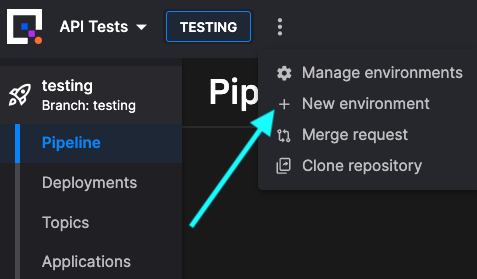
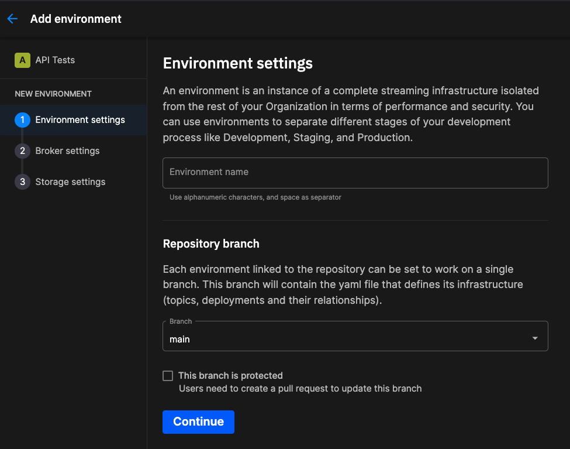
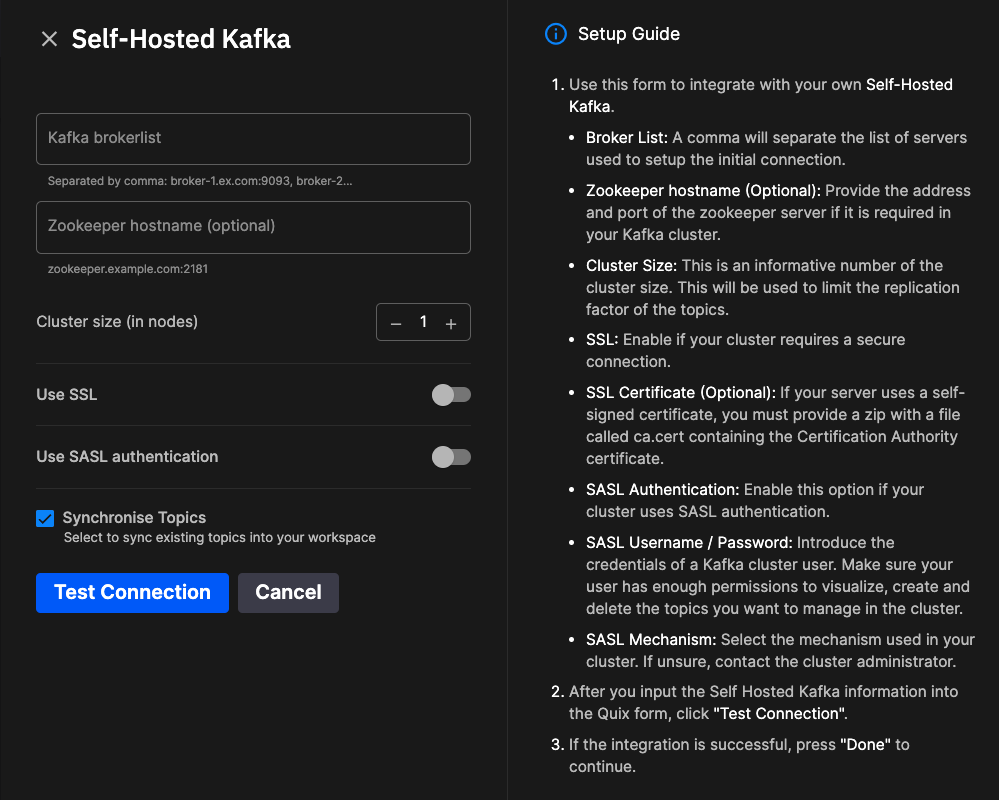

# Create an environment

When you [create a project](create-project.md), you'll need to create at least one environment. This page describes how to create an environment in more detail.

## Watch a video

<iframe src="https://www.loom.com/embed/877ae703f0cf458f8827341549adce6c?sid=a1fed45f-b4a2-4442-8d9e-c981b6286fcb" frameborder="0" webkitallowfullscreen mozallowfullscreen allowfullscreen style="position: absolute; top: 0; left: 0; width: 100%; height: 100%;"></iframe>

## How to create a new environment

There are several ways you can create a new environment, if you've not created one as part of creating the project. For example, you can do it from the top-level kebab menu:

{width=60%}

You can also create an environment from the main project screen:

{width=60%}

## Name and branch

You now need to give your environment a name, and select (or create) the branch it is associated with:

{width=60%}

You can enter any suitable name for your environment. Examples could be: production, testing, develop, staging, prototype, and so on. Any name that suits the use case can be used.

An environment is always associated with a branch. You can select a branch that already exists (such as when you have connected your project to an existing Git repository), but you are also free to create any new branches you need - simply click `+ New branch` from the branch dropdown, in the `Environment settings` dialog.

## Broker settings

You now choose the Kafka broker you use with Quix.

There are three broker options:

1. Quix broker
2. Managed Kafka
3. Self-hosted

Each of these is described briefly in the following sections.

### Quix broker

The simplest and most convenient choice is to use Quix-managed Kafka. No installation of Kafka is required, and configuration can be done through the UI if you need to change the sensible default values. Very little knowledge of Kafka is expected, beyond basic familiarity with concepts such as [topics](../get-started/glossary.md#topic).

There is a small charge for storage for messages persisted in a topic: 

{width=80%}

### Managed Kafka

Quix has integrations with common Kafka hosting providers. There are three options here:

1. [Confluent Cloud](https://www.confluent.io/confluent-cloud/){target=_blank}
2. [Redpanda](https://redpanda.com/){target=_blank}
3. [Aiven](https://aiven.io/kafka){target=_blank}

Select your managed broker option, and then follow the detailed setup guide provided to connect Quix to the broker.

### Self-hosted Kafka

If you want to install and manage your own Kafka installation, you can do this too, as long as the Kafka Cluster is available on the Internet. You'll need to do more configuration, and be very familiar with details of Kafka hosting and configuration. Selecting this option presents you with a setup guide:

{width=90%}

You also have the option to test your connection with the Kafka server before continuing.

## Data and streaming services

The last step in creating an environment is to choose your data and streaming services option. 

{width=60%}

There are two options here:

* Standard
* High performance

These options determine the following:

* The amount of storage available to persisted topics
* The level of resources (CPU, RAM) allocated to streaming services

### Persisted storage

Persisted storage is when you enable persistence on a topic: 

{width=80%}

When this option is selected, data in the topic is persisted to a Quix database (InfluxDB). This data can then be queried using the [Query API](../apis/query-api/overview.md), or played back into a topic using the [replay service](../manage/replay.md). 

!!! note

    Persisted storage is not the same as topic storage. Topic storage is charged separately, and relates to storage allocated to messages retained in a Kafka topic, for the [Quix broker option](#quix-broker).

### Streaming services

Services that experience improved performance when selecting the "High performance" option include the following:

* GitService - this is the service that synchronizes your Quix environment with the project's Git repository.
* [Replay Service](../manage/replay.md) - enables replay of persisted data into a topic.
* [Streaming Reader](../apis/streaming-reader-api/overview.md) - service that enables a client to subscribe to a Quix topic.
* [Streaming Writer](../apis/streaming-writer-api/overview.md) - service that enables a client to publish to a Quix topic.
* [Query API](../apis/query-api/overview.md) - query data persisted in the Quix database.

Generally, if you notice sluggish performance in one of these services, it may mean for the volumes and frequency of data you are processing, you might need the High performance option.

!!! tip

    While you can't directly upgrade a standard environment to a high performance environment, you can create a new environment that uses the high performance option. You can create this environment using any branch (or even a new branch) suitable for your use case. For example, if you had a `staging` branch that was currently a standard environment, and you needed to upgrade it to a high performance environment, you could delete the environment, and create a new environment using the high performance option, and link it to the `staging` branch.

### Use cases

Standard is designed for proof-of-concept, experimentation, and testing environments.

High performance is designed for production environments.

## 🏃‍♀️ Next step

[Learn about protected environments :material-arrow-right-circle:{ align=right }](./protected-environment.md)
