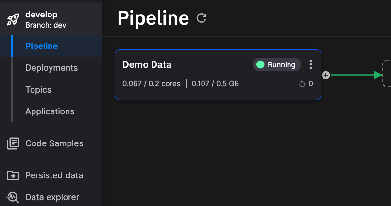
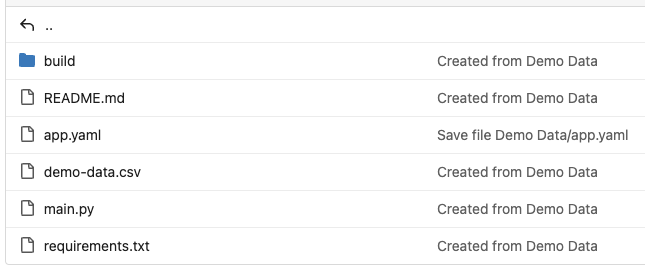

# Explore project structure

This page looks at the file structure of a typical project in Quix, as hosted in its Git repository. 

A project in Quix maps to a Git repository. Within a project you can create multiple environments, and these correspond to branches in the Git repository. Within a branch (environment) there are some root files. One example of this is `quix.yaml` which defines the pipeline, and then each application in the pipeline has its own folder, containing code and configuration, such as the `main.py` and `app.yaml` files.

## Pipeline

This section shows an example pipeline consisting of one application, `Demo Data`, as illustrated by the following screenshot:



Looking at the project stored in Git, it would have the following structure:


Note the `quix.yaml` file that defines the entire pipeline. There is aso a folder for the application, `Demo Data`.

The complete `quix.yaml` file is shown here:

``` yaml
# Quix Project Descriptor
# This file describes the data pipeline and configuration of resources of a Quix Project.

metadata:
  version: 1.0

# This section describes the Deployments of the data pipeline
deployments:
  - name: Demo Data
    application: Demo Data
    deploymentType: Job
    version: ada522b5199fc9667505b4dd19980995804ca764
    resources:
      cpu: 200
      memory: 200
      replicas: 1
    libraryItemId: 7abe02e1-1e75-4783-864c-46b930b42afe
    variables:
      - name: Topic
        inputType: OutputTopic
        description: Name of the output topic to write into
        required: true
        value: f1-data

# This section describes the Topics of the data pipeline
topics:
  - name: f1-data
    persisted: false
    configuration:
      partitions: 2
      replicationFactor: 2
      retentionInMinutes: -1
      retentionInBytes: 262144000
```

This defines one or more deployments, and their allocated resources, as well as other information such as the code commit version to use, in this case `ada522b`. The topics in the pipeline are also defined here.

## Application

Opening the `Demo Data` folder in the Git repository, you see the structure of the application (one service in the pipeline) itself:



The notable file here is the `app.yaml` file that defines important aspects of the application. The full `app.yaml` for this application is shown here:

``` yaml
name: Demo Data
language: python
variables:
  - name: Topic
    inputType: OutputTopic
    description: Name of the output topic to write into
    defaultValue: f1-data
    required: true
dockerfile: build/dockerfile
runEntryPoint: main.py
defaultFile: main.py
```

This provides a reference to the Dockerfile that is to be used to build the application before it is deployed. This is located in the `build` directory, and the full Dockerfile for this application is shown here:

``` yaml
FROM python:3.11.1-slim-buster

ENV DEBIAN_FRONTEND="noninteractive"
ENV PYTHONUNBUFFERED=1
ENV PYTHONIOENCODING=UTF-8

WORKDIR /app
COPY --from=git /project .
RUN find | grep requirements.txt | xargs -I '{}' python3 -m pip install -i http://pip-cache.pip-cache.svc.cluster.local/simple --trusted-host pip-cache.pip-cache.svc.cluster.local -r '{}' --extra-index-url https://pypi.org/simple --extra-index-url https://pkgs.dev.azure.com/quix-analytics/53f7fe95-59fe-4307-b479-2473b96de6d1/_packaging/public/pypi/simple/
ENTRYPOINT ["python3", "main.py"]
```

This defines the build environment used to create the container image that will run in Kubernetes.

As well as the `app.yaml` the application folder also contains the actual code for the service, in this case in `main.py` - the complete Python code for the application.

There is also a `requirements.txt` file - this is the standard Python file that lists modules to be installed. In this case there is only one requirement that is "pip installed" as part of the build process, `quixstreams==0.5.4`, the [Quix Streams client library](../quix-streams-intro.md).

Any data files required by the application can also be located in the application's folder. In this example there is a `demo-data.csv` file that is loaded by the application code.

While this documentation has explored a simple project consisting of a pipeline with one application (service), pipelines with multiple applications have a similar structure, with a `quix.yaml` defining the pipeline, and with each application having its own folder, containing its application-specific files and an `app.yaml` file. 
