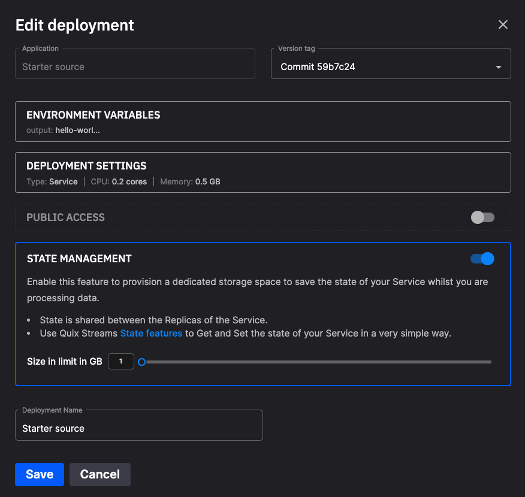

# State management

When deploying a service, enabling state management enables the service to maintain its state between restarts by creating a storage area for data and files, ensuring persistence across service restarts.

## Enabling state management

Enable state management during service deployment if your code relies on state or expects files to persist across restarts:

{width=80%}

Enabling state creates a `state` folder that can be accessed by your code. 

!!! important

    Note that data stored in this area is retained between service restarts and is shared between all replicas of the service, but it is not available globally to other services.

## Storing files in the state folder

You can use this `state` folder as a place to download and store model and other files. 

!!! note

    While the `state` folder is not visible in the UI, it is still available for use.

For example, the following code downloads a model file to the `state` folder. It subsequently loads the model file from the `state` folder when needed:

``` python
import requests

model = requests.get('https://acme.com/models/model1.dat')
f = open('./state/model1.dat', 'wb')
f.write(model)
f.close()
...
f = open('./state/model1.dat', 'rb')
...
```

The model can be modified at run time, and its state is preserved between service restarts.

!!! note

    There is a 100GB storage limit for the state management storage area.

## Using state from Quix Streams

If you have enabled state management for a service, then you can also use the [state management features](https://quix.io/docs/client-library/state-management.html) of Quix Streams in that service. This enables you to store and retrieve data in various formats, and retain that state between service restarts. See the [documentation](https://quix.io/docs/client-library/state-management.html) for further details.

## Running Quix Streams locally

If you are running Quix Streams locally, rather than using it as part of a deployed service in the cloud, then the `state` folder is created automatically for you when you use state management features of the library. For example, if you ran the following code locally:

``` python
from quixstreams import LocalFileStorage

storage = LocalFileStorage()
storage.clear()

storage.set("KEY1", 12.51)
storage.set("KEY2", "str")
storage.set("KEY3", True)
storage.set("KEY4", False)
```

Then you would see the `state` folder and its contents:

```
$ ls state
key1 key2 key3 key4
```
