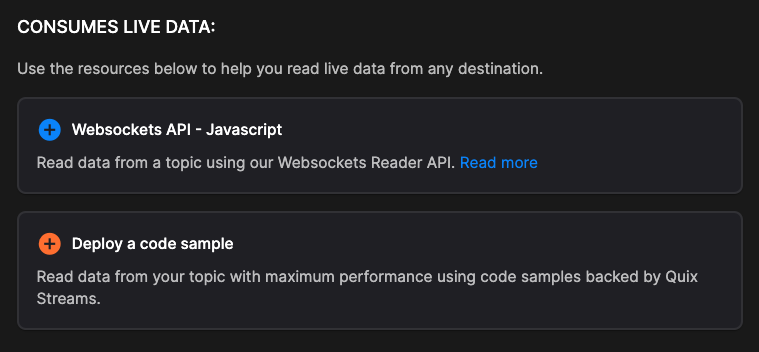

# External destination

One simple way to read data out of a Quix topic, is to use the prebuilt connector called `External destination`.

To use the `External destination` connector, step through the following procedure:

1. In the UI click on `Code Samples` in the left-hand sidebar. 

2. Search for `External destination`. 

3. Click `Add external destination`.

4. Select the input topic that you want to read data from.

5. Give your destination a name.

6. Click `Add external destination`.

7. In the Pipeline view click the newly created source and the following is displayed:

    {width=80%}

8. For this example, select `WebSockets API - JavaScript`. Code is generated for you that uses the Streaming Reader API (SignalR - WebSockets interface).

9. Click the `Copy code` button to copy the code to your clipboard. 

You can now paste the code into your JavaScript code, for example, your web browser client code. The code reads data from the Quix topic that you configured.

As you can see there are other options such as deploying a code sample. 

The code samples generated are meant to provide you with a starting point from which you can build your own solutions. They provide a convenient way to see how the API works.

## Next steps

Further information can be found in the [Streaming Reader API](../../apis/streaming-reader-api/overview.md) documentation.
