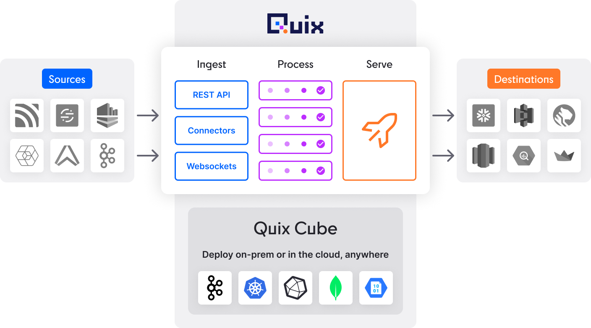

# Overview

Welcome to the Quix Tour! 

The Quix Tour is designed to help you build a complete stream processing pipeline with Quix **in less than 30 minutes** (ten minutes per stage of the pipeline). If you've already done the Quickstart, the time to completion is **under 20 minutes**. 

## Video

Watch the video showing what you're going to build:

<iframe src="https://www.loom.com/embed/5b0a88d2185c4cfea8fd2917d3898964?sid=7ea745ef-6dee-45ca-b6db-1fb450b671c8" frameborder="0" webkitallowfullscreen mozallowfullscreen allowfullscreen style="position: absolute; top: 0; left: 0; width: 100%; height: 100%;"></iframe>

## The code

The complete code for the Quix Tour can be found in the [Quix Tutorials GitHub repository](https://github.com/quixio/tutorial-code/tree/main/quixtour){target=_blank}.

## The parts

The Quix Tour is split into three parts. These parts represent the typical stream processing **pipeline**:

1. **Ingest** - this is where you get your data into Quix using one of [many methods](../../develop/integrate-data/overview.md). In Quix Platform this is typically implemented using a **Source**.
2. **Process** - here you process your data in a manner depending on your use case. In Quix Platform this is implemented using a **Transform**.
3. **Serve** - typically you display information, such as on real-time charts, or perhaps persist your data in a database. In Quix Platform this is implemented using a **Destination**.

This general stream processing architecture is illustrated in the following diagram:

## CPU overload detection pipeline

The pipeline you will implement:

1. **Ingest** - you publish data from your laptop into Quix Platform using the Quix client library, Quix Streams. You're going to publish your real-time CPU load. You could alternatively publish data from a CSV file, or any other source required for your use case. If you needed to connect to an external service, you could alternatively use one of Quix's many [connectors](../../connectors/index.md).
2. **Process** - in this step, you process your data. There are many [types of processing](../../develop/process/types-of-processing.md), one of which is the transform. There are many possible [types of transform](../../develop/process/types-of-transform.md). Here you create a transform that performs threshold detection. You publish a message to the transform's output topic. 
3. **Serve** - when you receive a message indicating CPU load has exceeded the threshold you (optionally) send an SMS to the system administrator.

!!! note

    The components in the pipeline are connected together by **topics**.

## Prerequisites

To complete the Quix Tour you'll need the following:

1. [Python installed](https://www.python.org/downloads/){target=_blank} on your machine.
2. A [free Quix account](https://portal.platform.quix.ai/self-sign-up).
3. (Optional) A free [Vonage API account](https://developer.vonage.com/sign-up).

## 🏃‍♀️ Next step

Get your data into Quix Platform!

[Ingest your data :material-arrow-right-circle:{ align=right }](./ingest-push.md)
