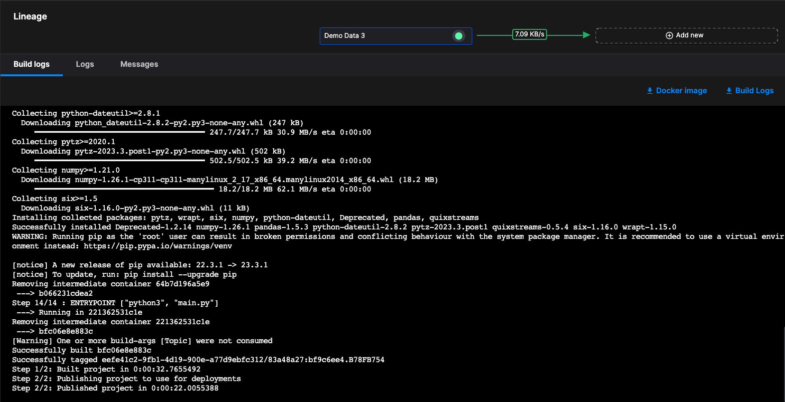
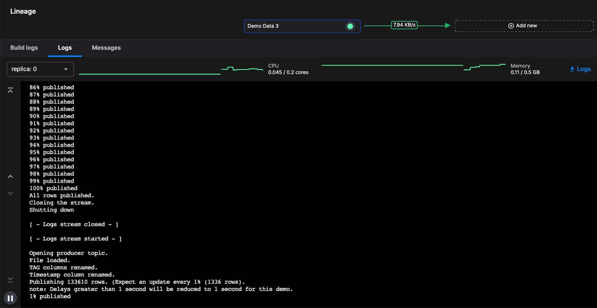
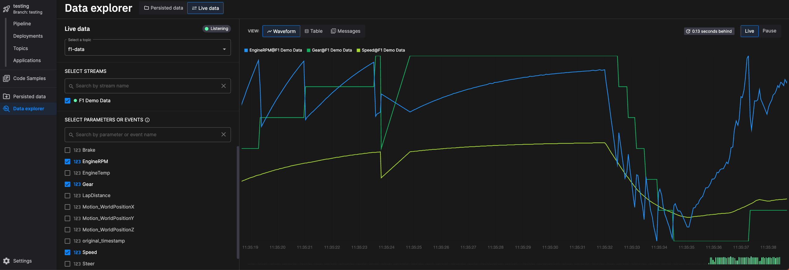
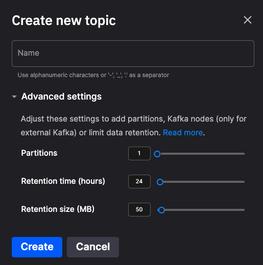

# Manage your projects

This section of the documentation covers **managing your projects, pipelines, and applications**.

## Logs

When you build an application for deployment, you can view build logs for it:

Any problems with the build are shown here. There is also a button to enable you to download the build logs for offline viewing.

When looking at a deployment at run time, you can view logs for the service or job. Any run time errors are shown here.

There is also a button to enable you to download the logs for offline viewing.

There is also a tab with messages view. This is described in a later section.

## Data explorer

When your pipeline is running, and the applications are generating data on topics, you can use the Data Explorer to view data in real time.

You can select the topic you want to view data on, and then the stream within that topic, as well as the specific parameters and events you are interested in. These can be displayed in waveform, table, or message view. The following screenshot illustrates the waveform view:

Table view enables you to view the parameter data in a tabular format, and messages view enables you to view the raw message data. 

## Message viewer

The message view shows the raw message format. The message viewer is available next to the Build logs, and logs tabs, as shown in the following screenshot:

The data explorer also has a message viewer tab, as can be seen in the [data explorer section](#data-explorer).

## Persistence

While data in a Kafka topic is retained according to the topic retention time configured when you create a new topic:

Quix also has an additional capability called persistence. Enabling persistence is done by simply activating a slider control:

Enabling this feature persists topic data into a database for later retrieval using the [Query API](../apis/query-api/overview.md), or for replay using the replay service. 

The Query API is useful for testing and reviewing historical data. 

The replay service is used to play back persisted data into a topic. 

## Replay service

The replay service enables you to play persisted data back into a topic.

You can read more about the [replay service](./replay.md) in the docs.

## Query API

The Query API enables you to programmatically retrieve persisted data from the database.

You can read more about the [Query API](../apis/query-api/overview.md) in the docs.

## Portal API

The Portal API enables you to programmatically control Quix, and most objects in it. Using the Portal API you can manage entities including:

* Billing
* Deployments
* Profile
* Repositories
* Topics
* Users

You can read more about the [Portal API](../apis/portal-api/overview.md) in the docs, or view the [Swagger reference](https://portal-api.platform.quix.ai/swagger/index.html){target=_blank}.
