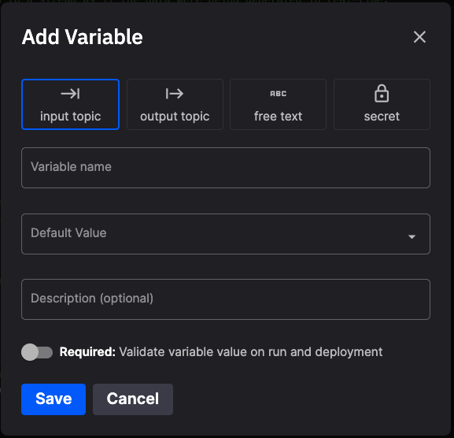
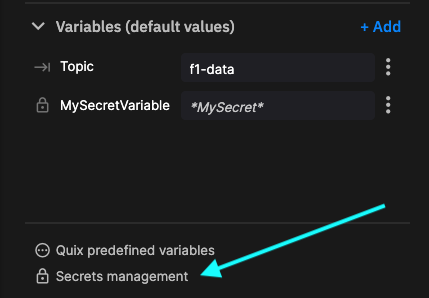

# How to add environment variables in Quix Platform

In Quix Platform, it is possible to create new environment variables that your code can then access. This is useful for things like API keys, secrets, and passwords for other services that your code may need to access.

## To create an environment variable

To add environment variables that you can access from your code, open the code view for your service, and in the `Environment variables` panel, click `+ Add`. 

{width=60%}

The `Add Variable` dialog is displayed:

{width=60%}

Complete the information for the environment variable. You can select properties such as `Text Hidden` for variables that represent API secrets, keys, and passwords. If necessary, you can also make a variable required.

## To access an environment variable

Once the variable has been created, you can then access the variable in your code using `os.environ["variable"]`. For example, to access the environment variable `API_SECRET`, your code would be:

```python
api_secret = os.environ["API_SECRET"]
print(api_secret)
```

## Secrets management

Sometimes you connect the [Quix Connectors](../connectors/index.md), or services you have created, to other services, such as AWS, Vonage, Twilio, Azure and so on. You usually need to provide credentials to access these third-party APIs and services, using environment variables. 

You do not want to expose these credentials through the use of environment variables in your YAML code, service code, Git repository, or even the UI, which may have shared access. Quix provides a feature to enable your credentials to be stored securely - secrets management.

Using secrets management, you can create secret variables whose value is hidden in code (Git repository and Application code view), UI, and YAML code. The value is encrypted. This is ideal for environment variables used to provide credentials to third-party services and APIs in a secure manner.

## Create a secret variable

To create a secret variable:

1. In the code view for your application, select `Secrets management`:

    

2. Click `+ New variable`.

3. Give your secret variable a name, a default value, and a value for the current environment, or environments if you have more than one for this project. 

4. Click `Save changes` to save the secret variable.

## To use a secret variable

You can't use the secret variable directly, you need to create an environment variable that uses it. 

To create an environment variable that uses a secret variable:

1. In the `Add Variable` dialog, select the `secret` icon.

2. Give the environment variable a name.

3. Select the corresponding secret variable from the dropdown list.

Now, when the environment variable appears in code or the UI, its value is the secret variable you assigned, but you cannot not see the value of the secret variable, only its name.
