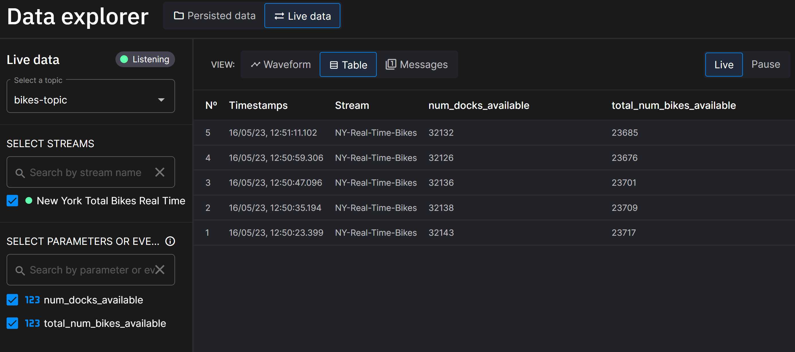

# View and store the data

With the Quix Platform it's easy to visualize your data in a powerful and flexible way, you can see the data in real time, as well as viewing historical data.

The Quix Platform was designed for real-time data, so if you want to see data-at-rest for any topic you must turn on data persistence for that specific topic. You'll do this in the [historical data](#historical-data) section.

## Real-time data

Follow these steps to view real-time data as it arrives into your topics:

1. On the `Pipeline` page, click on the grey or green arrow coming out of the `New York Bikes` service.

2. Click `Explore live data` on the context menu.

3. Select a stream from the streams listed under `SELECT STREAMS`.

	!!! note 

		If there are no streams under `SELECT STREAMS`, wait a few moments, the New York CitiBike API is queried every few seconds.

4. Select the parameters in the `SELECT PARAMETERS OR EVENTS` list.

5. Select the `Table` tab in the top middle of the page.

6. After a few moments you will see data being shown in the table.

	

!!! tip "Be patient"

	If you don't see any `streams`, `parameters` or data, just wait a moment or two. The next time data arrives these will be populated automatically.

Now you know how to observe data arriving into your topics. You can also explore the `Waveform` tab to see numeric data in a graphical form and the `Messages` tab to see the raw, [JSON format](https://en.wikipedia.org/wiki/JSON){target=_blank}, messages.

## Historical data

In order to train a machine learning model on historical data, the live real-time data being ingested needs to be stored. However, topics are real time and therefore not designed for data storage. To solve this, Quix allows you to store the data going through a topic to an efficient real-time database if you need it.

Enable persistence on your topics:

1. Navigate to the `Topics` page using the left-hand navigation.

2. Locate the topic(s) you want to store data for (in this case `bikes-topic` and `weather-topic`).

3. Click the toggle in the `Persistence` column to `on`.

4. Finally, go back to the `Pipeline` page.
	
	Now, to ensure there is some historical data stored in the weather topic, stop and then start the `VisualCrossing Weather` service. This will force the service to collect and publish fresh data to the `weather-topic` without waiting for 30 minutes. 

	You will need this historical data in the next section, where you will learn how to retrieve data for training a model. 

[Part 4 - Get data to train a model :material-arrow-right-circle:{ align=right }](4-train.md)
