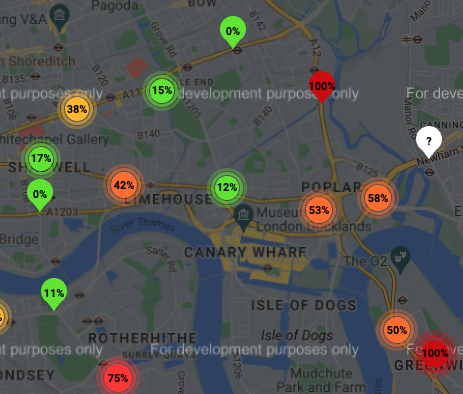

# Other services

There are some additional services in the pipeline that provide useful functionality. These range from S3 storage of data to calculation of vehicles per hour in a specific location.


Briefly, these other services are:

1. *Cam vehicles* - calculates the total vehicles, where vehicle is defined as one of: car, 'bus', 'truck', 'motorbike'. This number is fed into the *Max vehicle window* service.

2. *Max vehicle window* - calculates the total vehicles over a time window of one day. This service sends messages to the Data API service.

3. *Data API* - this REST API service provide two endpoints: one returns the *Max vehicle window* values for the specified camera, and the other endpoint returns camera data for the specified camera. This API is called by the UI to obtain useful data.

4. *S3* - stores objects in Amazon Web Services (AWS) S3. This service enables you to persist any data or results you might like to keep more permanently.

## What they do

The key thing this service does is ...

### Cam vehicles

This service simply adds together objects of the following types: car, bus, truck, motorbike. It classes these objects as vehicles. The message output to the next stage in the pipeline, max vehicles, is as follows:

``` json
{
  "Epoch": 0,
  "Timestamps": [
    1694077540745375700
  ],
  "NumericValues": {
    "truck": [
      1
    ],
    "car": [
      2
    ],
    "lat": [
      51.4075
    ],
    "lon": [
      -0.19236
    ],
    "delta": [
      -2.177236557006836
    ],
    "vehicles": [
      3
    ]
  },
  "StringValues": {},
  "BinaryValues": {
    "image": [
      "(Binary of 157.97 KB)"
    ]
  },
  "TagValues": {}
}
```

In this example there are 2 cars, and 1 truck giving a `vehicles` count of 3.

### Max vehicles

The max vehicles service takes the total vehicle count and finds the maximum value over a one day window. This value is made available to the Data API service. The message passed to the Data API has the following format:

``` json
{
  "Epoch": 0,
  "Timestamps": [
    1694088514402644000
  ],
  "NumericValues": {
    "max_vehicles": [
      8
    ]
  },
  "StringValues": {},
  "BinaryValues": {},
  "TagValues": {
    "window_start": [
      "2023-09-06 12:08:12.394372"
    ],
    "window_end": [
      "2023-09-07 12:08:12.394372"
    ],
    "window": [
      "1d 0h 0m"
    ],
    "cam": [
      "JamCams_00001.08959"
    ]
  }
}
```

You can see the exact time window is recorded, along with the maximum vehicle count during that time window. This provides a crude measure of the capacity of the road. This capacity can then be used by the UI to calculate a percentage of capacity. For example, if there are 8 cars on a road, and the maximum seen is 10, then the road is considered to be at 80% capacity, and this is displayed on the UI, as shown in the following screenshot:



### Data API

The Data API provides these endpoints:

* max_vehicles
* detected_objects

These are used by the UI to obtain and display the data on the web interface.

#### Max Vehicles 

Returns the maximum number of "vehicles" seen on a camera, where vehicles is one of cars, buses, trucks, or motorbikes.

For a `GET` on the endpoint `/max_vehicles`, the response is a dictionary item per camera:

* Key=camera name
* Value=max vehicle count

Example response JSON:

``` json
{
    "JamCams_00001.01251":2.0,
    "JamCams_00001.01252":1.0
}
```

#### Detected Objects 

Returns a dictionary of all the data for a given camera (except for the images as these are quite large to store, even temporarily).

For a `GET` on the endpoint `/detected_objects`, the response is:

* Key=camera name
* Value=dictionary of the data

Where the data dictionary is:

* object counts (car: 3, bus: 11 etc)
* lat
* lon
* timestamp

Using this you can plot/display every camera and its count as soon as you get this data.

Example response JSON:

``` json
"JamCams_00001.01419": {
    "car":{"0":3.0},
    "delta":{"0":-1.0003459453582764},
    "image":{"0":""},"lat":{"0":51.5596},
    "lon":{"0":-0.07424},"person":{"0":3.0},
    "timestamp":{"0":1692471825406959867},
    "traffic light":{"0":1.0},
    "truck":{"0":1.0}
}
```

### S3

This is the standard Quix code sample [AWS S3 destination connector](https://quix.io/docs/library_readmes/connectors/s3-destination.html). It takes messages on the input topic and writes them to S3. There is an optional batching facility whereby you can batch messages and then write them to S3 in a batch - this can be more efficient for higher frequency data. You can control batching based on time interval or message count.

## See also

For more information refer to:

* [Connectors](../../connectors/index.md) - connectors, both source and destination.
* [Quix Streams](../../../client-library-intro.md) - the client library.

## 🏃‍♀️ Next step

[Part 7 - Summary :material-arrow-right-circle:{ align=right }](../image-processing/summary.md)
