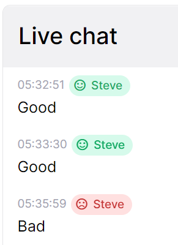

# 2. Analyze

In [Part 1](chat-app.md) you deployed a Chat App UI, sent some messages and maybe used your phone or sent the link to a friend or colleague and you saw messages being displayed in the Chat UI in real-time.

Now it's time to analyze the sentiment of the conversation by adding a new node to the processing pipeline. This will utilize a prebuilt model from [huggingface.co](https://huggingface.co/){target=_blank} to analyze the sentiment of each message flowing through the microservice.

The microservice subscribes to data from the `messages` topic and publishes sentiment results to the `sentiment` topic.

The code you're about to build gets the job done and meets the needs of this tutorial. However, it is by no means production ready.

## Evaluating sentiment

The sentiment of each message will be evaluated by this new microservice in your message processing pipeline.

Follow these steps to deploy the prebuilt microservice:

1. Navigate to the Library and search for `Sentiment analysis`

2. Click `Setup & deploy`

5. Ensure the "input" is set to `messages`

    This is the topic that is subscribed to for messages to analyze

6. Ensure the "output" is set to `sentiment`

    This is the topic that sentiment results are published to

6. Click `Deploy`

7. You can once again go to the Web UI project you deployed in [Part 1](chat-app.md). 

9. Enter values for `Room` and `Name` and click `CONNECT`.

10. Now enter chat messages and see the sentiment being updated in real-time each time a message is posted.
    
    {width=200px}

    !!! info
        The sentiment analysis service you just deployed will subscribe to the `messages` topic. The sentiment is returned to the Web UI via the `sentiment` topic and displayed both in the chart and next to the comment in the chat window by colorizing the chat user’s name.

!!! success 

	You have added to the pipeline by building and deploying a microservice to analyze the chat messages in real-time

[Subscribe to Tweets from Twitter by following Part 3 of this tutorial :material-arrow-right-circle:{ align=right }](twitter-data.md)