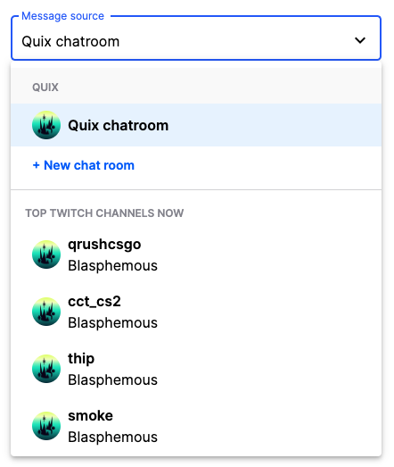

# Twitch service

In the UI as well as using the chat interface to send messages, you can also select Twitch channels and perform sentiment analysis on the messages published there:



## 💡 Key ideas

The key ideas on this page:

* A Quix service can use external APIs to retrieve data and then publish that data into a Quix topic
* Publish time series data

## What it does

The Twitch service uses the [Twitch API](https://dev.twitch.tv/docs/api/){target=_blank} to read messages from some of the most popular channels. It then publishes these messages to the output topic, `messages`. 

In the following code you can see that a time series object is created, with a timestamp, the chat message, and other data, and then published to the output stream:

``` python
def publish_chat_message(user: str, message: str, channel: str, timestamp: datetime, role: str = "Customer"):
    timeseries_data = qx.TimeseriesData()
    timeseries_data \
        .add_timestamp(timestamp) \
        .add_value("chat-message", message) \
        .add_tags({"room": "channel", "name": user, "role": role})

    stream_producer = topic_producer.get_or_create_stream(channel)
    stream_producer.timeseries.publish(timeseries_data)
```

The message format on the output `messages` topic:

``` python
{
  "Epoch": 0,
  "Timestamps": [
    1695378597074000000
  ],
  "NumericValues": {},
  "StringValues": {
    "chat-message": [
      "@CaalvaVoladora Boomerdemons is also up"
    ]
  },
  "BinaryValues": {},
  "TagValues": {
    "room": [
      "channel"
    ],
    "name": [
      "benkebultsax"
    ],
    "role": [
      "Customer"
    ]
  }
}
```

## 🏃‍♀️ Next step

[Part 6 - Customize the UI :material-arrow-right-circle:{ align=right }](customize-the-ui.md)

