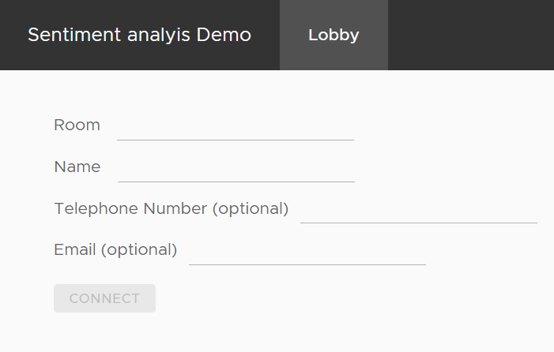
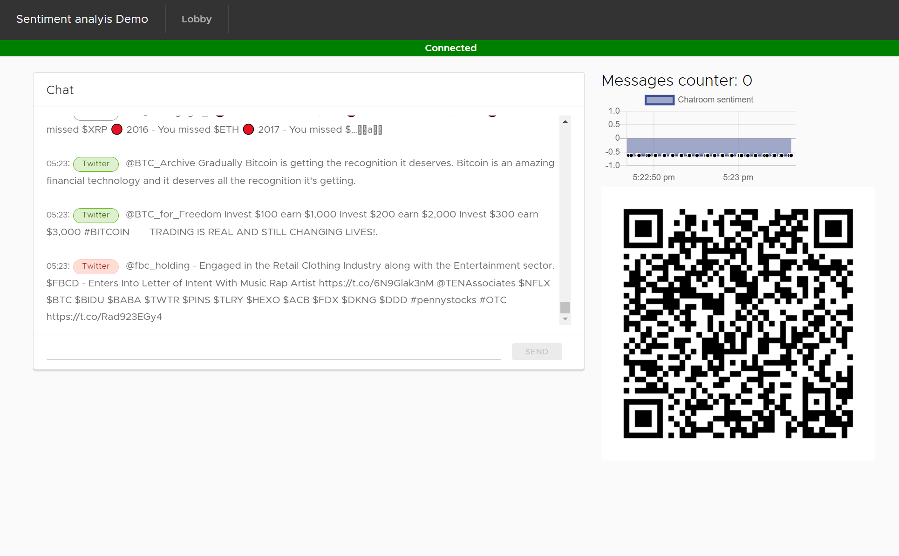

Build a real time sentiment analysis pipeline. Use the power and ease of
Quix to process high volume tweets or user sourced conversation
messages.

# Get Started

To get started make sure you have a Quix account, signup for a
completely free account at <https://quix.io>

You’ll also need a Twitter developer account.

A rough guide to getting this is as follows:

Register for an account here
<https://developer.twitter.com/en/apply-for-access>

1.  Fill out the forms, there are quite a few\!

2.  Wait for Twitter to provide you with your account.

3.  Once you have your account locate the “Keys and Tokens” page

4.  Save your bearer token for later

Use one of the many guides on YouTube or try [this
one](https://youtu.be/vlvtqp44xoQ?t=21) if you need some help creating
your Twitter developer account and filling in all those forms.

If you need any assistance, we’re here to help in [The
Stream](https://join.slack.com/t/stream-processing/shared_invite/zt-13t2qa6ea-9jdiDBXbnE7aHMBOgMt~8g),
our free Slack community.

## Library

Most of the code you need has already been written for you and it’s
located in our library. We’ll be referring to the library often so make
sure you know where it is.

# Pipeline Services

There are 4 stages to the pipeline you will build in this tutorial.

## Twitter Data Source

Our Twitter connector, pre-built to save you time.

## Twitter to chat

Convert Twitter text to chat messages, so they can be used alongside
manually entered chat messages.

## Sentiment analysis

Do the real work of analyzing chat and tweet sentiment.

## Web UI

A web UI allowing you to enter and see messages as well as see the
sentiment changes in real time.

# Build It

This guide will show you how to deploy each stage of the processing
pipeline, starting with the Web UI.

## 1\. Web UI

Follow these steps to deploy the Web UI.

1.  Navigate to the Library and locate “Sentiment Demo UI”.

2.  Click “Edit code”

3.  Click “Save as project” The code for this Angular UI is now saved to
    your workspace

### Tag the code and deploy the UI

1.  Click the +tag button at the top of any code file

2.  Enter v1 and press enter

3.  Click Deploy near the top right corner

4.  In the deployment dialog, select v1 under the “Version Tag”
    
    This is the tag you just created

5.  Click “Service” in “Deployment Settings”
    
    This ensures the service runs continuously

6.  Click the toggle in “Public Access”

7.  This enables access from anywhere on the internet

8.  Click “Deploy”
    
    The UI will stream data from the “sentiment” and “messages” topics
    as well as send messages to the “messages” topic.

9.  Once deployed, click the service tile

10. Click the “Public URL”
    
    > This is the user interface for the demo. This screenshot shows the
    > view you’ll see after creating a “room” to chat in.


## 2\. Sentiment analysis

Follow these steps to deploy the sentiment analysis stage.

1.  Navigate to the Library and locate “Sentiment analysis”
    transformation.

2.  Click “Edit code”

3.  Click “Save as project”
    
    The code for this transformation is now saved to your workspace

4.  Locate main.py

5.  Locate the line of code that creates the output stream
    
    ``` python
    output_stream=output_topic.create_stream(input_stream.stream_id)
    ```

6.  Append "-output" to the stream id.
    
    This will ensure the Web UI is able to locate the sentiment being
    output by this transformation service.
    
    ``` python
    output_stream=output_topic.create_stream(input_stream.stream_id + "-output")
    ```

### Tag the code and deploy the service

1.  Click the +tag button at the top of any code file

2.  Enter v1 and press enter

3.  Click Deploy near the top right corner

4.  In the deployment dialog, select v1 under the “Version Tag”
    
    This is the tag you just created

5.  Click “Service” in “Deployment Settings”
    
    This ensures the service runs continuously

6.  Click “Deploy”
    
    This service receives data from the “messages” topic and streams
    data out to the “sentiment” topic. . You can now go to the public
    URL of the Web UI project you deployed in step one. . Enter values
    for “Room” and “Name” . Click connect.
    
    
    
    You can now enter “chat” messages.
    
    
    
    > The messages will be passed to the sentiment analysis service you
    > deployed in step two. The sentiment is returned to the Web UI and
    > displayed both in the chart and next to the comment in the chat
    > window by colorizing the chat user’s name.

## 3\. Tweet to chat conversion

Follow these steps to deploy the tweet-to-chat conversion stage.

1.  Navigate to the Library and apply the following filters
    
    1.  Languages = Python
    
    2.  Pipeline Stage = Transformation
    
    3.  Type = Basic templates

2.  Select “Empty template- Transformation”.

3.  Click “Edit code”

4.  Change the name to “tweet-to-chat”

5.  Change the input to “twitter-data” by either selecting it or typing
    it.

6.  Ensure the output is set to “messages”

7.  Click “Save as project”
    
    The code for this transformation is now saved to your workspace

8.  Locate main.py

9.  Locate the line of code that creates the output stream
    
    ``` python
    output_stream = output_topic.create_stream(input_stream.stream_id)
    ```

10. Change this line to get or create a stream called “tweets”
    
    ``` python
    output_stream = output_topic.get_or_create_stream("tweets")
    ```

11. Now locate quix\_function.py
    
    Alter the on\_pandas\_frame\_handler to match the code below
    
    ``` python
    def on_pandas_frame_handler(self, df: pd.DataFrame):
    
    for index, row in df.iterrows():
    
    text = row["text"]
    
    self.output_stream.events.add_timestamp_nanoseconds(row.time)\
    
    .add_tag("name", "Twitter") \
    
    .add_value("chat-message", text) \
    
    .write()
    ```
    
    > This will take “text” from incoming tweets and stream them to the
    > output topics tweets stream as event values with a key of
    > “chat-message” which the other stages of the pipeline will
    > recognize.

### Now tag the code and deploy the service with these steps:

1.  Click the +tag button at the top of any code file

2.  Enter v1 and press enter

3.  Click Deploy near the top right corner

4.  In the deployment dialog, select v1 under the “Version Tag”
    
    This is the tag you just created . Click “Service” in “Deployment
    Settings” . This ensures the service runs continuously . Click
    “Deploy”
    
    This service receives data from the “twitter-data” topic and streams
    data out to the “messages” topic.
    
    > You now have a service that is ready to receive tweets and pass
    > them onto the sentiment processing stage.

## 4\. Twitter Data Source

Follow these steps to deploy the Web UI.

1.  Navigate to the Library and locate “Twitter Data - Source”.

2.  Click “Setup & deploy”

3.  Enter your Twitter bearer token into the appropriate field

4.  Click “Deploy”
    
    This service receives data from Twitter and streams it to the
    “twitter-data” topic. NOTE: that the default Twitter search
    criteria is looking for Bitcoin tweets, it’s a high traffic subject
    and great for the demo. Feel free to change this once you’ve got the
    demo working. . Locate the Web UI you deployed in step one .
    Navigate to the lobby . Enter “tweets” for the chatroom and provide
    your name in the “name” field . Click connect
    
    You will see Bitcoin tweets arriving in the chat along with the
    calculated average sentiment in a chart.
    
    

> Your pipeline is now complete, you can send and view chat messages,
> receive tweets and analyze the sentiment of all of the messages.

> Share the QR code with colleagues and friends to talk about anything
> you like while Quix analyzes the sentiment in the room in real time.

# Next Steps

You’ve just made extensive use of the Quix library, our collection of
open source connectors, samples and examples. Now you can build your own
connectors and apps and contribute by going to our Github
[here](https://github.com/quixai/quix-library), forking our library repo
and submitting your code, updates and ideas.

What will you build, let us know. We’d love to feature your project or
use case in our newsletter.

If you need any assistance, we’re here to help in [The
Stream](https://join.slack.com/t/stream-processing/shared_invite/zt-13t2qa6ea-9jdiDBXbnE7aHMBOgMt~8g),
our free Slack community.

# Goodbye, for now..

We hope you enjoyed this tutorial on how to Build a real time chat and
tweet sentiment analysis pipeline.

If you have any questions or feedback please contact us on The Stream.

Thank you and goodbye for now\!
