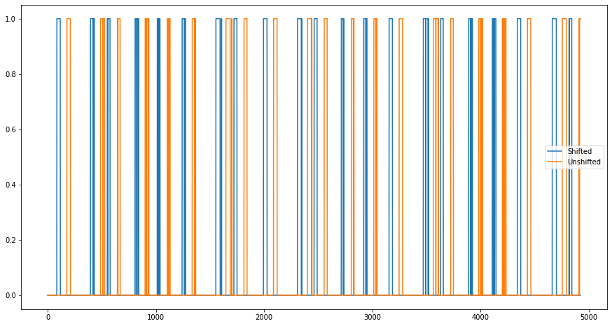
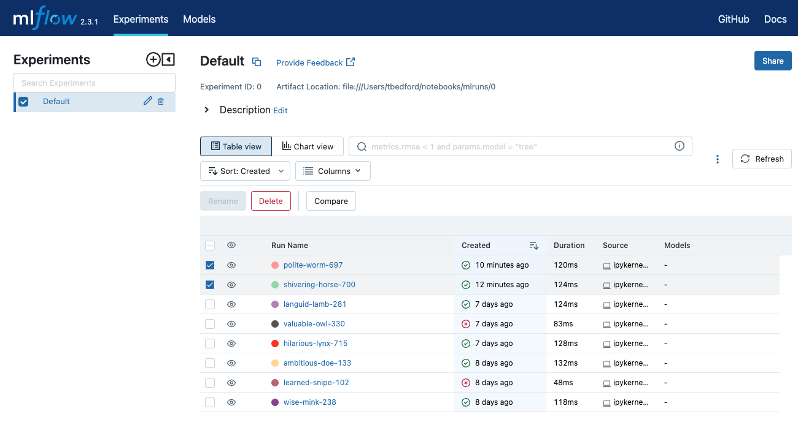
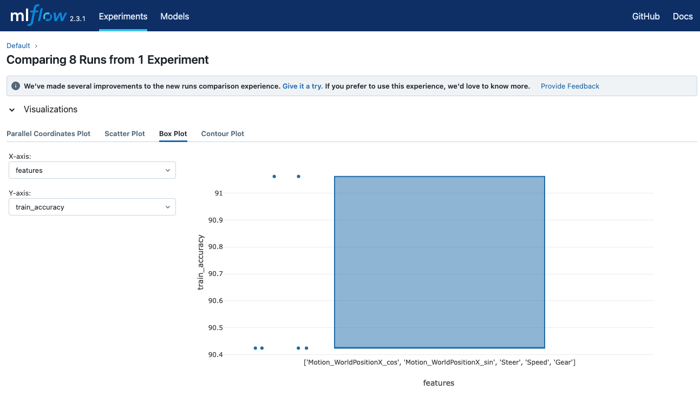

# Train your ML model

In this part you learn how to train an ML model using the data you imported in the [previous part](./import-data.md). 

You write code to train your model on this data. You save your model to a Pickle file, which you then deploy in the [next part](./deploy-ml.md) of this tutorial. 


## Install the required libraries

You now need to install some Python libraries on your system. This is the system where you are running Jupyter Notebook. If you do not have Jupyter Notebook installed, please refer to the [prerequisites](./index.md#prerequisites) for this tutorial.

The following libraries are required to create the ML model and visualize your data. To install the libraries enter the following commands into a terminal on the system where you are running Jupyter Notebook:

``` shell
python3 -m pip install seaborn
python3 -m pip install sklearn
python3 -m pip install mlflow
python3 -m pip install matplotlib
```

!!! note 
	
	If you get an 'Access Denied' error when installing `mlflow`, try adding `--user` to the install command, for example `python3 -m pip install mlflow --user`. Alternatively, run the installer from an Anaconda Powershell Prompt with `--user`.

## Include required imports

To run the code in this tutorial, you need to import the installed libraries. 

1. Add the following code to your Jupyter Notebook:

    ``` python
    import math
    import matplotlib.pyplot as plt
    import mlflow
    import numpy as np
    import pandas as pd
    import pickle
    import seaborn as sns

    from sklearn import tree
    from sklearn.model_selection import KFold
    from sklearn.metrics import confusion_matrix, accuracy_score
    from sklearn.tree import DecisionTreeClassifier
    ```

2. Click `Run` and ensure there are no errors. If you receive any errors, make sure you have installed the required libraries.

You have now installed all the required libraries and tested their presence using the import statements.

## Preprocessing of parameters

You now need to prepare data for training by applying some transformations to the retrieved data. In this case you convert the world X coordinates into continuous values.

Run the following code in your Jupyter Notebook:

``` python
## Convert motion to continuous values
df["Motion_WorldPositionX_sin"] = df["Motion_WorldPositionX"].map(lambda x: math.sin(x))
df["Motion_WorldPositionX_cos"] = df["Motion_WorldPositionX"].map(lambda x: math.cos(x))
```

## Convert the brake values to boolean

Braking values are fully off `0`, or fully on `1`, or somewhere in between for partial braking.

You can convert the braking value to a boolean value, using the Python `round()` function. Run the following code:

``` python
## Conversion of label
df["Brake_bool"] = df["Brake"].map(lambda x: round(x))
```

The lambda function applies rounding to all braking values in the data frame.

## Generate advanced brake signal for training

To train the model to predict braking 5 seconds ahead, you need to shift the braking values to 5 seconds ahead. Run the following code:

``` python
## Offset dataset and trim it
NUM_PERIODS = -round(5e9/53852065.77281786)

df["Brake_shifted_5s"] = df["Brake_bool"].shift(periods=NUM_PERIODS)
df = df.dropna(axis='rows') # clean out null values
```

To plot the resulting data, run the following code in your Jupyter Notebook:

``` python
plt.figure(figsize=(15, 8))
plt.plot(df["Brake_shifted_5s"])
plt.plot(df["Brake_bool"])
plt.legend(['Shifted', 'Unshifted'])
```

The resulting plot is as follows:



You can see from the plot that the blue data (shifted) has been shifted 5 seconds ahead of the orange data (unshifted).

## Fit, predict, and score a model

You now calculate class weighting to gain accuracy by performing class balancing:

``` python
Y = df["Brake_shifted_5s"]

cw = {}
for val in set(Y):
    cw[val] = np.sum(Y != val)

print(cw)
```

This prints a value such as:

```
{0.0: 2859, 1.0: 19944}
```

## Training the model

In the following code snippet you run an experiment using **MLflow**. Notice in last three lines that each experiment is logging **MLflow** metrics for comparison purposes. Run the following code in your Jupyter Notebook:

``` python
model_accuracy = pd.DataFrame(columns=[
    'Baseline Training Accuracy',
    'Model Training Accuracy',
    'Baseline Testing Accuracy',
    'Model Testing Accuracy',
])

kfold = KFold(5, shuffle=True, random_state=1)

with mlflow.start_run():
    class_weight = None
    max_depth = 5
    features = ["Motion_WorldPositionX_cos", "Motion_WorldPositionX_sin", "Steer", "Speed", "Gear"]

    mlflow.log_param("class_weight", class_weight)
    mlflow.log_param("max_depth", max_depth)
    mlflow.log_param("features", features)
    mlflow.log_param("model_type", "DecisionTreeClassifier")

    X = df[features]
    decision_tree = DecisionTreeClassifier(class_weight=class_weight, max_depth=max_depth)

    for train, test in kfold.split(X):
        X_train = X.iloc[train]
        Y_train = Y.iloc[train]
        X_test = X.iloc[test]
        Y_test = Y.iloc[test]

        # Train model
        decision_tree.fit(X_train, Y_train)
        Y_pred = decision_tree.predict(X_test)

        # Assess accuracy
        train_accuracy = round(decision_tree.score(X_train, Y_train) * 100, 2)
        test_accuracy = round(decision_tree.score(X_test, Y_test) * 100, 2)

        Y_baseline_zeros = np.zeros(Y_train.shape)
        baseline_train_accuracy = round(accuracy_score(Y_train, Y_baseline_zeros) * 100, 2)
        Y_baseline_zeros = np.zeros(Y_test.shape)
        baseline_test_accuracy = round(accuracy_score(Y_test, Y_baseline_zeros) * 100, 2)

        model_accuracy_i = pd.DataFrame({
            "Baseline Training Accuracy": [baseline_train_accuracy],
            "Model Training Accuracy": [train_accuracy],
            "Baseline Testing Accuracy": [baseline_test_accuracy],
            "Model Testing Accuracy": [test_accuracy]})
        model_accuracy = pd.concat([model_accuracy, model_accuracy_i]).reset_index(drop=True)

    mlflow.log_metric("train_accuracy", model_accuracy["Model Training Accuracy"].mean())
    mlflow.log_metric("test_accuracy", model_accuracy["Model Testing Accuracy"].mean())
    mlflow.log_metric("fit_quality", 1/abs(model_accuracy["Model Training Accuracy"].mean() - model_accuracy["Model Testing Accuracy"].mean()))
```

You can review the model accuracy of the experiment by typing the following Python into your Jupyter Notebook:

``` python
model_accuracy
```

This displays data on the model accuracy:

| Depth | Baseline Training Accuracy | Model Training Accuracy | Baseline Testing Accuracy | Model Testing Accuracy |
| ----- | -------------------------- | ----------------------- | ------------------------- | ---------------------- |
| 0     | 88.97                      | 97.93                   | 86.49                     | 86.49                  |
| 1     | 87.59                      | 97.24                   | 91.89                     | 83.78                  |
| 2     | 89.04                      | 96.58                   | 86.11                     | 88.89                  |
| 3     | 88.36                      | 97.95                   | 88.89                     | 83.33                  |
| 4     | 88.36                      | 97.95                   | 88.89                     | 80.56                  |

## Prediction preview

You can plot the actual braking against the predicted braking using the trained model with the following code:

``` python
f, (ax1, ax2) = plt.subplots(2, 1, sharey=True, figsize=(50,8))
ax1.plot(Y)
ax1.plot(X["Speed"]/X["Speed"].max())

ax2.plot(decision_tree.predict(X))
ax2.plot(X["Speed"]/X["Speed"].max())
```

Running this code in your Jupyter Notebook results in the following plot:


The blue line is the predicted braking, the orange is the actual speed of the car. You can see the speed of the car slows, in correlation to the predicted braking.

## Saving the model

When you are confident with the results, save the model into a Pickle file:

``` python
pickle.dump(decision_tree, open('./decision_tree_5_depth.sav', 'wb'))
```

!!! tip
 
	The Pickle file will be located in folder where Jupyter Notebook command was invoked.

## MLflow

To help you with managing your experiments, you can review them in MLflow:

!!! warning

	MLflow works only on MacOS, Linux, or Windows Linux Subsystem (WSL).

!!! tip

	To have some meaningful data, run the experiment with three different values for the `max_depth` parameter.

In a terminal window, run the following command to launch the MLflow server:

``` python
mlflow ui
```

In the UI you can select the experiments to compare:



You can also plot metrics from experiments:



[Deploy your Machine Learning (ML) model :material-arrow-right-circle:{ align=right }](deploy-ml.md)
