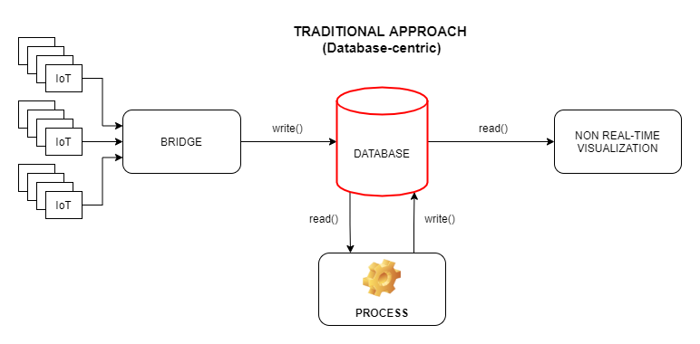
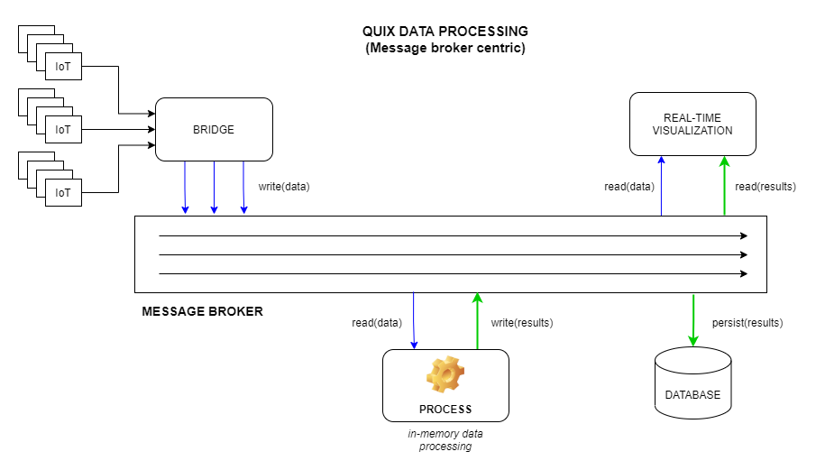

# What is Quix Platform?

Quix Platform is a complete system for developing and deploying applications for the processing of real-time streaming data. Quix Platform includes an online IDE for developing, debugging, and deploying your real-time streaming applications. In addition, Quix also provides an open source library called Quix Streams.Quix Streams is the client library that you use in your Python or C# code to develop custom elements of your processing pipeline.

Quix Platform was built on top of a message broker, specifically [Kafka](../client-library/kafka.md), rather than on top of a database, as databases introduce latency that can result in problems in real-time applications, and can also present scaling issues. Scaling databases for real-time applications also introduces more cost and complexity. Quix Platform helps abstract these issues, providing you with a scaleable and cost effective solution. 

Broker technology allows the developer to work with live data in memory, rather than data retrieved using complex queries from disk. This is much faster and therefore more suited to real-time applications. However, the problem with broker technologies can be that they are more complex to use. Quix Platform and Quix Streams provide abstractions and tools that make working with your real-time data processing much easier than working with broker technology directly.

Quix also treats Python developers as first-class citizens, making it easier for Python developers to work with real-time data using the abstractions and tools they are already familiar with, such as using the pandas dataframe format. 

## The Quix stack

Quix provides everything a developer needs to build low-latency real-time streaming applications. 

From the top-down, the Quix stack provides the following:

* Quix Portal, the web-based Integrated Development Environment (IDE). [Sign up for free](https://portal.platform.quix.ai/self-sign-up).
* [REST and websocket APIs](../apis/index.md)
* [Quix Streams](../client-library-intro.md)

These allow developers to:

* Use a full web-based IDE with version control and logging, to build their applications. 
* Have abstracted access to underlying broker infrastructure, including fully-managed Kafka topics.
* Access the Quix serverless compute environment for hosting your web-based real-time streaming applications.
* Connect existing web applications and IoT clients.
* Access the real-time data catalogue, which is a time-series database.

(diagram needs updating)

## Quix Portal

**Quix Portal** strives to present an intuitive software experience that facilitates DevOps/MLOps best practices for development teams. The goals of Quix Portal are to:

* Help a broad spectrum of developers access live data.
* Help developers create and manage complex infrastructure and write application code without support from expert engineering teams.
* Help to accelerate the development lifecycle by enabling developers to test and iterate code in an always-live environment.

To achieve these goals, Quix Portal includes the following features:

* **Online IDE**: Develop and run your real-time streaming applications directly in the browser without setting up a local environment.

* **Quix samples**: Choose from the [prebuilt code examples](../platform/connectors/index.md) ready to run and deploy from the IDE.

* **One-click deployments**: Configure, deploy, and manage your streaming applications with a simple user interface.
 
* **Monitoring tools**: Monitor the status and data flow of your streaming applications in real time.

* **Broker management**: Create, delete, explore and configure your self-hosted message broker infrastructure from the Quix Portal.

* **Pipeline view**: Visualize your pipeline architecture with the information provided from the deployment variables. You can also monitor your pipeline in real time.

* **Data Explorer**: Explore live and historical data of your applications to test that your code is working as expected.

## APIs

Quix provides four APIs to help you work with streaming data. These include:

* [**Stream Writer API**](../apis/streaming-writer-api/intro.md): enables you to send any data to a Kafka topic in Quix using HTTP. This API handles encryption, serialization, and conversion to the Quix Streams format, ensuring efficiency and performance of down-stream processing regardless of the data source.

* [**Stream Reader API**](../apis/streaming-reader-api/intro.md): enables you to push live data from a Quix topic to your application, ensuring low latency by avoiding any disk operations.

* [**Data Catalogue API**](../apis/data-catalogue-api/intro.md): enables you to query historic data streams in the data catalogue, in order to train ML models, build dashboards, and export data to other systems.

* [**Portal API**](../apis/portal-api.md): enables you to automate Quix Portal tasks such as creating workspaces, topics, and deployments.

## Quix Streams

Python is the dominant language for data science, data engineering, and machine learning, but it needs to be interfaced carefully with streaming technologies, such as [Kafka](../client-library/kafka.md), which are predominantly written in Java and Scala.

[Quix Streams](../client-library-intro.md) provides Python and C# developers with a client library that abstracts the complexities of building streaming applications.

For Python developers, Quix Streams can provide streaming data packaged in a data frame, so you can write data processing logic and connect it directly to the abstracted broker. Developers can read about the most important streaming concepts in the [Quix Streams introduction](../client-library-intro.md).

## Serverless compute

Quix provides an easy way to run code in an elastic serverless compute environment. It automatically builds your code into a docker image, and deploys containers to Kubernetes. This usually complicated procedure is simplified using the Quix Portal UI.

### Architecture

### Git integration

Source code for workspace projects (models, connectors and services) is hosted in Git repositories. Developers can check out these repositories and develop locally and collaborate using Git. 

Code is deployed to the Quix serverless environment using Git tags. Quix builds the selected Git tag or commit into a docker image which is then deployed.

### Docker integration

Each code example included in the Quix Samples library is shipped with a `Dockerfile` that is designed to work in the Quix serverless compute environment powered by Kubernetes. You can alter this file if necessary. When you deploy a service with Quix, a code reference to Git with a build request is sent to the build queue. The build service builds a docker image and saves it in the docker registry. This image is then deployed to Kubernetes.

!!! tip

	If there is any problem with the docker build process, you can check the **build logs**.

### Kubernetes integration

Quix manages an elastic compute environment so you don’t need to worry about such details as servers, nodes, memory, and CPUs. Quix ensures that your container is deployed to the right server in the cluster.

Quix provides the following integrations with Kubernetes:

* **Logs** from the container accessible in the portal or using the Portal API.

* **Environment variables** allows passing variables into the Docker image deployment. This enables code to be configured using these parameters.

* **Replica** number for horizontal scale.

* **CPU** limit.

* **Memory** limit.

* **Deployment type** - Options of a one-time job or a continuously running service,

* **Ingress** - Optional ingress mapped to port 80.

!!! tip

	If a deployment reference is already built and deployed to a service, the build process is skipped and the docker image from the container registry is used instead.

### DNS integration

The Quix serverless environment offers DNS routing for services on port 80. That means that any API or frontend can be hosted in Quix with no extra complexity. Load balancing is achieved by increasing the replica count to provide resiliency to your deployed API or frontend.

!!! warning

	A newly deployed service with DNS routing takes up to 10 minutes to propagate to all DNS servers in the network.

## Managed Kafka topics

Quix provides fully managed Kafka topics which are used to stream data and build data processing pipelines by daisy-chaining models together.

Our topics are multi-tenant which means you don’t have to build and maintain an entire cluster. Instead, you can start quickly and cheaply by creating one topic for your application and only pay for the resources consumed when streaming that data. When your solution grows in data volume or complexity you can add more topics without concern for the underlying infrastructure, which is managed by Quix.

Together with [Quix Streams](../client-library-intro.md) and serverless compute, you can connect your models directly to Quix topics to read and write data using the pub/sub pattern. This keeps the data in-memory to deliver low-latency and cost-effective stream processing capabilities.

!!! note

	Quix also provides the ability to connect Quix Portal to external infrastructure components such as your own message broker infrastructure.

## Data Catalogue

Quix provides a data catalogue for long-term storage, analytics, and data science activities.

The Quix data catalogue combines the best database technologies for each data type into a unified catalogue. There’s a timeseries database for recording your events and parameter values, blob storage for your binary data, and a NoSQL database for recording your metadata.

The Quix data catalogue technology has two advantages:

1.  It allocates each data type to the optimal database technology for that type. This increases read/write and query performance, which reduces operating costs.

2.  It uses your metadata to record your context. This makes your data more accessible across your organization, as users only need to know your business context in order to navigate vast quantities of data.

## In-memory processing

Traditional architectures for applications that need to process data have always been very database-centric. Typically you write data to the database, retrieve it with complicated queries, process the data, and then write it back to a complex database schema. This approach does not scale to real-time uses cases, especially when large amounts of data are involved. 

In use cases where you need results in seconds, and where you may potentially have large amounts of data (for example from thousands of IoT devices transmitting telemetry data), a real-time stream processing approach is required, and that is what Quix was designed for.

Quix uses an underlying message broker and it puts it at the very center of the application, enabling a new approach for processing data without the need to save and pass all the information through a database. By using in-memory processing, you can persist only the data you're really interested in keeping.

This approach lowers the complexity and cost of real-time data processing and is the only possible approach when you need to process a huge amount of data per second, with low latency requirements.
