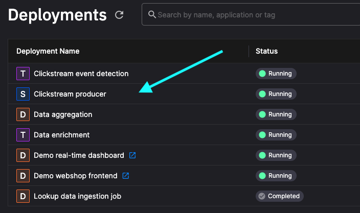
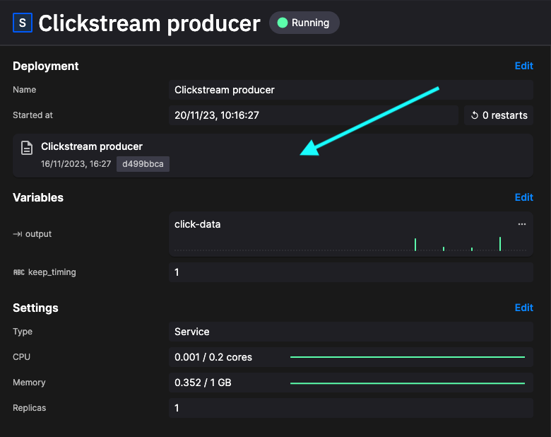

# Clickstream producer

!!! warning

    This tutorial is out of date. Please check the [tutorials overview](../overview.md) for our latest tutorials.

In this project the clickstream data is read from a CSV file. This data represents fifteen days of shopping data gathered from a real online store. 


## Data published

A subset of this data is then published to the `click-data` topic:

* `ip` - the IP address of the customer
* `original_timestamp` - the Unix timestamp for the interaction
* `productId` - product ID (the product ID is embedded in the URL for the product viewed)
* `userAgent` - browser details for the client
* `userId` - UUID for the user

This service runs continually, reloading the data from the CSV file. There's also an option (`keep_timing`) to keep the original timing of the data - this is the default in the ungated experience (the live demo). 

## Exploring the message format

If you click `Topics` in the main left-hand navigation you see the topics in the environment:


Click in the `Data` area to view live data. This takes you into the Quix data explorer. You can then select the stream and parameter data you'd like to explore. You can then view this data in either the `Table` or `Messages` view.

If you look at the messages in the `Messages` view, you'll see data has the following format:

``` json
{
  "Epoch": 0,
  "Timestamps": [
    1699973201619326000
  ],
  "NumericValues": {
    "original_timestamp": [
      1331802578
    ]
  },
  "StringValues": {
    "userId": [
      "F6F8B460-4204-4C26-A32C-B93826EDCB99"
    ],
    "ip": [
      "75.85.165.38"
    ],
    "userAgent": [
      "Mozilla/5.0 (Macintosh; Intel Mac OS X 10_6_8) AppleWebKit/534.52.7 (KHTML, like Gecko) Version/5.1.2 Safari/534.52.7"
    ],
    "productId": [
      "VD55179433"
    ]
  },
  "BinaryValues": {},
  "TagValues": {}
}
```

The Quix data explorer is a very useful tool for debugging and monitoring your pipeline.

## Viewing the deployed application

In the left-hand main navigation, click `Deployments` to see all the deployed services and jobs in the environment:



Click `Clickstream producer` to select the deployment. This takes you to an extremely useful screen where you can:

1. View the status of the deployment (such as CPU, memory usage, and replicas assigned).
2. See the live logs for the service.
3. See the topic lineage for the service.
4. Access Build logs (in case of errors when the service is built).
5. Access the Messages tab, where you can then see messages associated with the service in real time.

## Viewing the application code

There are many ways to view the code for the application (which is then deployed as a job or service). The quickest way from the current screen is to click the area shown:



You'll now be in the code view with the **version of the deployed code** displayed.

If you review the code, you'll see that the CSV file is read on a background thread, and data published to streams based on the `userId`:

``` python
stream_producer = producer_topic.get_or_create_stream(row['userId'])
stream_producer.timeseries.publish(df_row)
```

If you keep the original timing of the data, that is respected, although the delays are kept within 0 and 10 seconds. If `keep_timing` is `False` then a delay of 200ms is used between publishing data:

``` python
if not keep_timing:
    # Don't want to keep the original timing or no timestamp? That's ok, just sleep for 200ms
    time.sleep(0.2)
```

Feel free to explore the code further.

## Further reading

* [Read a CSV file](../../develop/integrate-data/read-csv.md)

## 🏃‍♀️ Next step

[Part 3 - Data ingestion :material-arrow-right-circle:{ align=right }](./data-ingestion.md)
