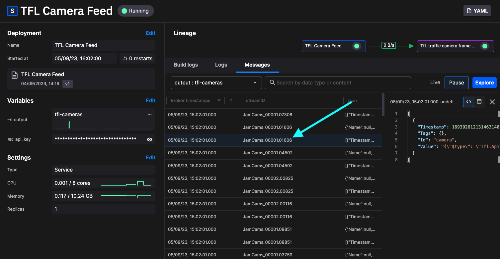

# TfL camera feed

!!! danger

    This tutorial is out of date. Please check the [tutorials overview](../overview.md) for our latest tutorials.

In this part of the tutorial you take a look at the TfL camera feed service. The main function of this service is to retrieve camera data from the TfL API and pass it to the frame grabber service.


!!! tip

    In the pipeline view, you can always determine a topic name by hovering over the connecting line that represents that topic. You can also click the connecting line, to see its name, and optionally to jump to the Data Explorer to view live data for the topic.

## 💡 Key ideas

The key ideas on this page:

* Reading external REST API
* Publishing event data with Quix Streams
* Multiple streams within a topic
* Passing video file URLs through the pipeline
* Explore raw message format using Quix

## What it does

The key thing this service does is retrieve the camera feeds from the TfL API endpoint, using your TfL API key. This is done using the `requests` library and a simple REST `GET`:

``` python
cameras = requests.get(
    "https://api.tfl.gov.uk/Place/Type/JamCam/?app_id=QuixFeed&app_key={}".format(api_key))
```

With this data the code loops, writing the data for each camera to its own stream in the output topic, `tfl-cameras`. The code also adds a timestamp and the camera data, as a value called `camera`:

``` python
producer_topic.get_or_create_stream(camera_id).events.add_timestamp_nanoseconds(time.time_ns()) \
    .add_value("camera", json.dumps(camera)) \
    .publish()    
```

Note the stream name is derived from the camera ID, which has the format `JamCams_00001.01606`.

!!! tip 

    It is a common pattern to publish data to its own stream when it is from a different device or source. For example, if you had multiple IoT devices each with its own ID these would publish to their own stream. As streams are mapped to partitions by Quix Streams, the messages are guaranteed to be delivered in order. Publishing to multiple streams enables you to horizontally scale too. If you increased the number of paritions in the topic, the streams would be spread across all available partitions, enabling increased throughput and fault tolerance. Further, multiple consumer replicas could be used, and stream data would be processed by all available replicas in the consumer group. In the TfL camera feed service, data for each camera is published to its own stream for these reasons, the stream name being based on the camera ID. If you ever need to obtain the stream ID, and it is not in the messsages available to that service, it is available through the stream object by using the `stream_id` property, for example, `stream_id = stream_consumer.stream_id`.

The code then sleeps for a configurable amount of time. This prevents exceeding the 500 API requests from being exceeded.

The `publish` method from the previous code publishes data to the output topic in the following format:

``` json
[
  {
    "Timestamp": 1693925495304353500,
    "Tags": {},
    "Id": "camera",
    "Value": "<data>"
  }
]
```

The field `<data>` has a format as shown in the following example:

``` json
{
  "$type": "Tfl.Api.Presentation.Entities.Place, Tfl.Api.Presentation.Entities",
  "id": "JamCams_00001.03766",
  "url": "/Place/JamCams_00001.03766",
  "commonName": "A20 Sidcup Bypass/Perry St",
  "placeType": "JamCam",
  "additionalProperties": [
    {
      "$type": "Tfl.Api.Presentation.Entities.AdditionalProperties, Tfl.Api.Presentation.Entities",
      "category": "payload",
      "key": "available",
      "sourceSystemKey": "JamCams",
      "value": "false",
      "modified": "2023-08-31T15:46:06.093Z"
    },
    {
      "$type": "Tfl.Api.Presentation.Entities.AdditionalProperties, Tfl.Api.Presentation.Entities",
      "category": "payload",
      "key": "imageUrl",
      "sourceSystemKey": "JamCams",
      "value": "https://s3-eu-west-1.amazonaws.com/jamcams.tfl.gov.uk/00001.03766.jpg",
      "modified": "2023-08-31T15:46:06.093Z"
    },
    {
      "$type": "Tfl.Api.Presentation.Entities.AdditionalProperties, Tfl.Api.Presentation.Entities",
      "category": "payload",
      "key": "videoUrl",
      "sourceSystemKey": "JamCams",
      "value": "https://s3-eu-west-1.amazonaws.com/jamcams.tfl.gov.uk/00001.03766.mp4",
      "modified": "2023-08-31T15:46:06.093Z"
    },
    {
      "$type": "Tfl.Api.Presentation.Entities.AdditionalProperties, Tfl.Api.Presentation.Entities",
      "category": "cameraView",
      "key": "view",
      "sourceSystemKey": "JamCams",
      "value": "West - A222 Perry St Twds Chislehurst",
      "modified": "2023-08-31T15:46:06.093Z"
    },
    {
      "$type": "Tfl.Api.Presentation.Entities.AdditionalProperties, Tfl.Api.Presentation.Entities",
      "category": "Description",
      "key": "LastUpdated",
      "sourceSystemKey": "JamCams",
      "value": "Aug 31 2023  3:46PM",
      "modified": "2023-08-31T15:46:06.093Z"
    }
  ],
  "children": [],
  "childrenUrls": [],
  "lat": 51.4183,
  "lon": 0.09822
}
```

There is much useful data here, including a link to the camera's video stream, which is in a MP4 video file stored on AWS S3, for example `https://s3-eu-west-1.amazonaws.com/jamcams.tfl.gov.uk/00001.03766.mp4`.

!!! tip

  It is more efficient to pass a link to a video through the pipeline than the video itself, as the video file size can be relatively large.

This message is passed on to the next service in the pipeline, the frame grabber.

## 👩‍🔬 Lab - Examine the data 

In this section, you learn how to use Quix to examine the message data format. There are various ways of doing this, and several ways are shown in later parts of this tutorial. Having clarity on the message format enables better undertanding of the data flow in the pipeline.

To see the message format on the output topic of the service:

1. In the pipeline view click on the TFL camera feed service tile.

2. Click the `Messages` tab and then click on a message. You will see something similar to the following screenshot:

    

    You might see messages that have the format:

    ``` json
    {
        "Name": null,
        "Location": null,
        "Metadata": {},
        "Parents": [],
        "TimeOfRecording": null
    }        
    ```

    These are stream metadata messages and are not used in this tutorial.

3. You can now see the message format in the right-hand pane:

    ``` json
    [
        {
            "Timestamp": 1693925495304353500,
            "Tags": {},
            "Id": "camera",
            "Value": "<data>"
        }
    ]
    ```

    This is the data published to the output topic, and passed on to the frame grabber.

## See also

For more information refer to:

* [Quix Streams](https://quix.io/docs/quix-streams/introduction.html) - More about streams, publishing, consuming, events and much more. 

## 🏃‍♀️ Next step

[Part 3 - Frame grabber :material-arrow-right-circle:{ align=right }](tfl-frame-grabber.md)
