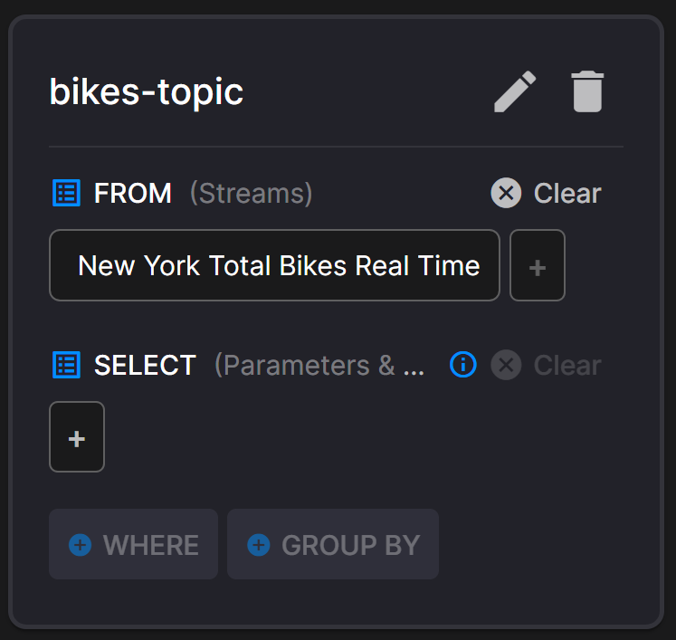
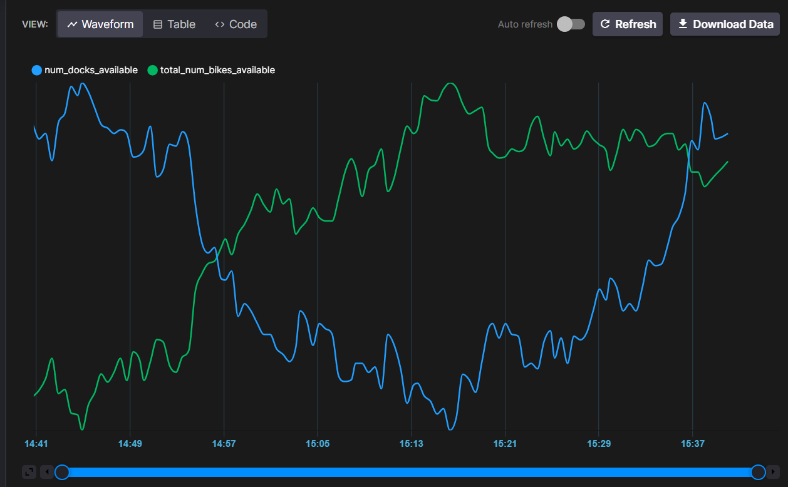
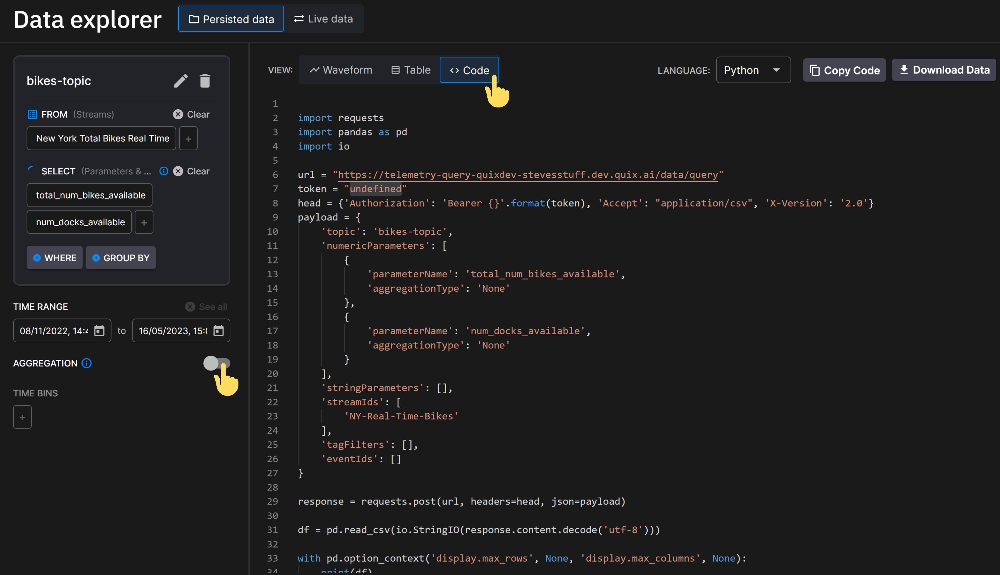
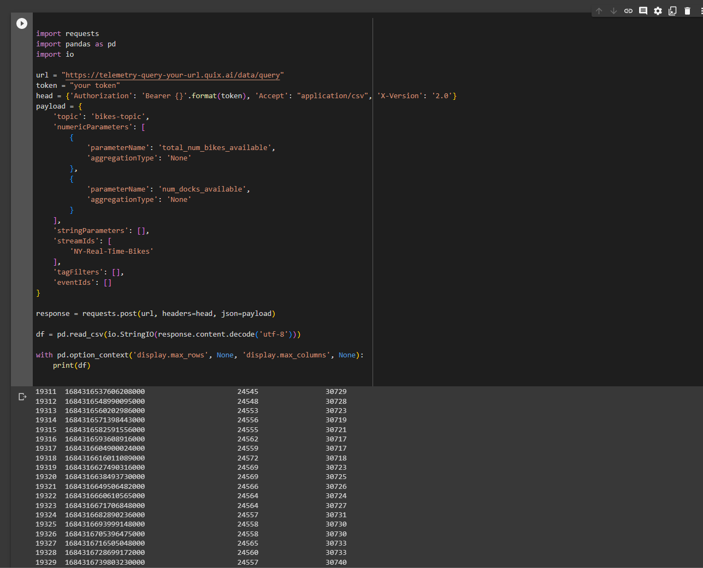

# Training data

Quix gives you the freedom to train the ML model your own way. If you already have tools and processes for doing that then you can train the model and use it in the Quix Platform where you can run it in real-time. 

Follow along and learn how to retrieve historical data from your topics, so you can train your model.

## Limited data set

You've already read about the limitations of the free Visual Crossing API. Namely, that it only enables requests for new data  1000 times per day and so the Quix Code Sample only requests data very 2 minutes, therefore at this point in the tutorial you may have a limited data set.

Continue following the tutorial to see how to access the accumulated historical data, however, after a few hours you will have more data to examine at which time you can repeat the steps again.

## Get the data

To access historical data:

1. Click `Persisted data` in the left-hand navigation.

2. Select the `bikes-topic` in the left-hand panel.

3. Mouse over a stream name in the table and click the `Visualize stream` icon.

	The page will navigate to the `Data explorer`.

4. You will see one of two scenarios represented in the `query builder` on the left-hand side. 

	Select the tab most applicable to what you see:

	

	=== "Pre-filled"

		If you see a prepopulated query builder:

		{width=250px}

		Follow these steps:

		1. Select the `+` under `SELECT (Parameters & Events)`.

		2. Select `total_num_bikes_available` from the list.
		
		3. Again select the `+` under `SELECT (Parameters & Events)`.

		4. Select `num_docks_available` from the list.

	=== "Empty"

		If you see an empty query builder:

		{width=250px}

		Follow these steps:

		1. Click `Add Query`.

		2. Select `bikes-topic` under `From topic`.

		3. Select the `New York Total Bikes Real Time` stream.

		4. Click `Next`.

		5. Select both parameters, that is both `num_docks_available` and `total_num_bikes_available`.

		6. Click `Done`.

	

	Whichever options you used, you should be looking at a visualization of the two selected parameters:

	{width=600px}

	Note that your data won't look the same as ours, so don't be concerned if they aren't identical.

8. Switch off `aggregation` to see all of the data.

9. Select the `Code` tab to view the code to access this data set from outside of Quix.

	

	!!! hint

		You can copy and paste this code into a [`Jupyter Notebook`](https://jupyter.org/){target=_blank} or [`Google Colab Notebook`](https://colab.research.google.com/){target=_blank} and run it to get your data there.

		{width=450px}

## Train the model

At this point, you are collecting historical data and you know how to query it for use outside the Quix Platform to train your ML models.

???- example "Need help training a model?"

	Follow our "How to train an ML model" tutorial [here](../train-and-deploy-ml/overview.md)

	You are walked through the process of getting the code to access the data (as described above), running the code in a Jupyter notebook, training the model and uploading your pickle file to Quix.

It would take several weeks to accumulate enough historical data to train a model, so you will continue the tutorial with some pre-trained models already built by the Quix team. This was done using the very same data flow you've just built. You can find the Jupyter notebook code used to train the model in the [Quix GitHub repo](https://github.com/quixio/NY-bikes-tutorial/blob/1stversion/notebooks-and-sample-data/04%20-%20Train%20ML%20models.ipynb){target=_blank}.

[Part 5 - Run the model :material-arrow-right-circle:{ align=right }](5-run.md)
