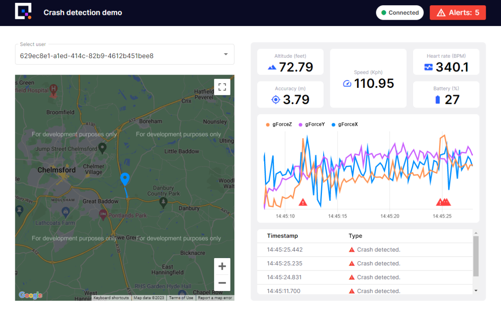

# Real-time event detection

In this tutorial you learn how to build a real-time event detection pipeline. Events are simulated crashes or accidents that could occur while driving or cycling. 

You deploy a crash detection service to detect crashes in real time, and a UI to view the location of the incident.

In this example the actual crash detection is performed using an ML model, pretrained with data from Quix. A [tutorial](../train-and-deploy-ml/overview.md) is also available that demonstrates how to train a basic model with a small subset of data. You can collect more data to train your model using more scenarios to ensure it’s accurate enough for your use case.

Once you have completed this tutorial you see the following UI:

{width=600px}

The UI displays a map with the route being taken, various data values sent from the data source, and the times and locations of events.

## The parts of the tutorial

This tutorial is divided into several parts to make it more a manageable learning experience. Feel free to complete the various parts at your own pace, your [Quix account](https://portal.platform.quix.ai/self-sign-up) is **free and credit renews each month**. The parts of this tutorial are as follows:

1. [**Data Acquisition**](./data-acquisition.md). Streaming data into the crash detection pipeline brings the solution to life. You have two options here, stream data live from your phone, or use some prerecorded CSV data based on the best option for your use case.

2. [**Build and deploy the crash detection service**](./crash-detection.md). This service uses an ML model to detect crashes in real time. You learn how to train the model using data obtained from Quix, but a pretrained model is also available.

3. [**Deploy the UI**](./crash-detection-ui.md). You deploy the demo UI. This is a prebuilt UI from the Quix Code Samples library. It displays the location of the device, and the location of any accident.

!!! tip

	If you need any help, please sign up to the [Quix community forum](https://forum.quix.io/){target=_blank}.

[Data acquisition :material-arrow-right-circle:{ align=right }](./data-acquisition.md)
