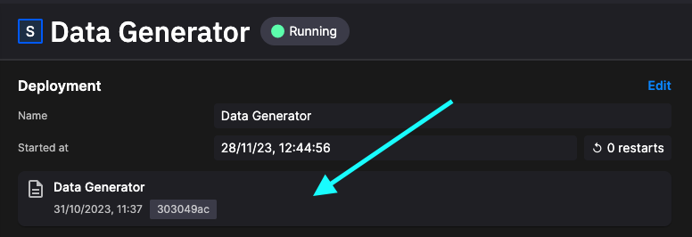

# Data generator

This service generates temperature data simulating one or more 3D printers. It simulates three temperature sensors on a fleet of 3D printers.


For each printer, the enclosure temperature is programmed to decrease starting at the 4 hour point. It will drop below the minimum threshold of 45°C at 5h:47m — the failure point.

The simulation speed is 10x actual spped, so the temperature will start to drop at approximately 24 minutes and cross the minimum threshold at around 34m 44s.

When printing with a heat-sensitive material such as ABS (Acrylonitrile Butadiene Styrene), it’s important to ensure that the temperatures remain stable.

The [forecasting algorithm](./forecast-service.md) that attempts to estimate when this is going to happen, and displays the alert on a dashboard.

## Data published

The generated data is published to the `json-3d-printer-data` topic:

* Ambient temperature
* Ambient temperature with fluctuations
* Bed temperature
* Hot end temperature
* original_timestamp
* Printer finished printing

This service runs continually.

## Exploring the message format

If you click `Topics` in the main left-hand navigation you see the topics in the environment. Click the topic to view live data. You can then view this data in either the `Table` or `Messages` view.

If you look at the messages in the `Messages` view, you'll see data has the following format:

``` json
{
  "hotend_temperature": 249.52922614294954,
  "bed_temperature": 110.12854118355098,
  "ambient_temperature": 38.70099292962708,
  "fluctuated_ambient_temperature": 38.70099292962708,
  "timestamp": "2024-04-16T17:07:03.717628",
  "original_timestamp": "2024-04-16T17:07:03.717628",
  "printer": "Printer 33"
}
```

The Quix topic explorer's message view is a very useful tool for debugging and monitoring your pipeline.

## Viewing the deployed application

In the left-hand main navigation, click `Deployments` to see all the deployed services and jobs in the environment. Click `Data Generator` to select the deployment. This takes you to an extremely useful screen where you can:

1. View the status of the deployment (such as CPU, memory usage, and replicas assigned).
2. See the live logs for the service.
3. See the topic lineage for the service.
4. Access Build logs (in case of errors when the service is built).
5. Access the Messages tab, where you can then see messages associated with the service in real time.

## Viewing the application code

There are many ways to view the code for the application (which is then deployed as a job or service). The quickest way from the current screen is to click the area shown:



You'll now be in the code view with the **version of the deployed code** displayed.

Review the code, you'll see that data is generated for each printer, and each printer has its own stream for generated data:

``` python
tasks = []
printer_data = generate_data()

# Distribute all printers over the data length (defaults to 60 seconds)
delay_seconds = get_data_length() / replay_speed / number_of_printers

for i in range(number_of_printers):
    # Set MessageKey/StreamID or leave parameters empty to get a generated message key.
    name = f"Printer {i + 1}"  # We don't want a Printer 0, so start at 1

    # Start sending data, each printer will start with some delay after the previous one
    tasks.append(asyncio.create_task(generate_data_async(topic, producer, name, printer_data.copy(), int(delay_seconds * i))))

await asyncio.gather(*tasks)
```

Feel free to explore the code further.

## 🏃‍♀️ Next step

[Part 3 - Downsampling service :material-arrow-right-circle:{ align=right }](./downsampling.md)
