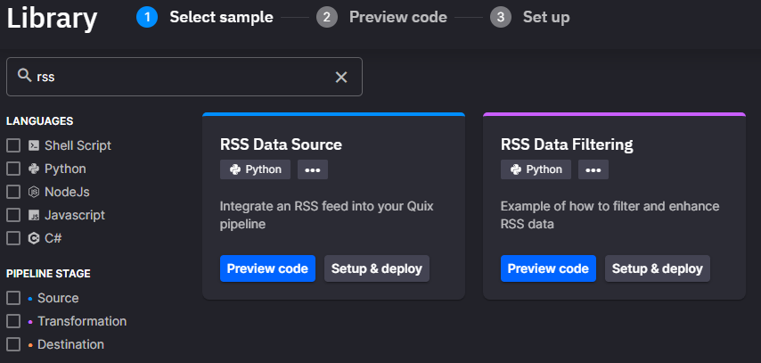
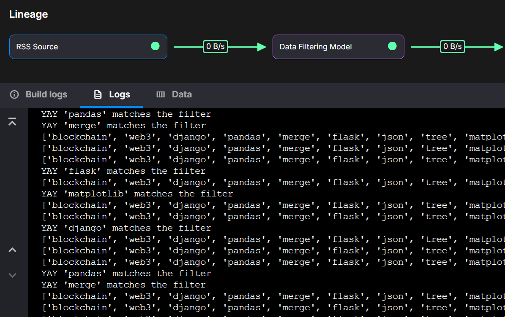
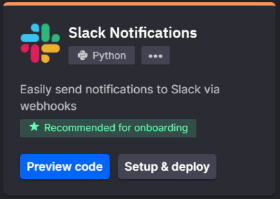

# RSS Processing

!!! danger

    This tutorial is out of date. Please check the [tutorials overview](../overview.md) for our latest tutorials.

## RSS processing pipeline

This tutorial explains how to build a pipeline that gathers and
processes data from an RSS feed and alerts users when specific criteria
are met. It’s a companion to a [live coding session](https://www.youtube.com/watch?v=X9swwr0Rjx4&t=1s){target=_blank}
on YouTube, where we sourced data from a StackOverflow RSS feed for use
in a Python service.

This tutorial has three parts

  - Sourcing data

  - Processing data

  - Sending alerts

What you need

  - A free [Quix account](https://quix.io/signup){target=_blank}. It
    comes with enough credits to create this application.

  - A Slack account with access to create a webhook. ([This guide](https://api.slack.com/messaging/webhooks){target=_blank} can help you with this step.)

### Sourcing data

#### 1. Get the `RSS Data Source` connector

In your Quix account, navigate to the `Code Samples` and search for `RSS Data Source.` (Hint: you can watch Steve prepare this code in the video tutorial if you’re like to learn more about it.)

Click `Deploy` on the `RSS Data Source` sample. (The card has a blue line across its top that indicates it’s a source connector.)

#### 2\. Configure the connector

In the configuration panel, keep the default name and output topic.
Enter the following URL into the rss_url field:
[https://stackoverflow.com/feeds/tag/python](https://stackoverflow.com/feeds/tag/python){target=_blank}

Click `Deploy` and wait a few seconds for the pre-built connector to be
deployed to your environment.

You will then begin to receive data from the RSS feed. The data then
goes into the configured output topic. Don’t worry, you won’t lose data.
It’s cached in the topic until another deployment starts reading it.

### Processing data

You can do anything you want in the processing phase of a pipeline. You
might want to merge several input streams or make decisions on your
data. In this tutorial, you’ll filter and augment data so that only
questions with certain tags get delivered to you.

#### 1\. Get the `RSS Data Filtering` connector

Return to the `Code Samples` and search for `RSS Data Filtering.`
Click `Deploy` on the card.

If you created a new envi for this application, the fields
automatically populate. If you’re using the environment for other
applications, you may need to specify the input topic as `rss-data.`

You might also want to customize the tag_filter. It is automatically
populated with a wide range of tags related to Python. This works well
for this demo, because you’ll see a large return of interesting posts.
But you can decrease or add tags.

#### 2\. Deploy `RSS Data Filtering` connector

Click `Deploy` on the `RSS Data Filtering` connector. Once deployed, the
connector will begin processing the data that’s been building up in the
rss-data topic.

Have a look in the logs by clicking the Data Filtering Model tile (pink
outlined) on the environment home page.

The transformation stage is now complete. Your application is now sending
the filtered and enhanced data to the output topic.

### Sending alerts

Last in our pipeline is the destination for our RSS data. This demo uses
a Slack channel as its destination.

#### 1\. Get the `Slack Notification` connector

Return to the `Code Samples` and search for the `Slack Notification.`
Click `Preview code.` You’re going to modify the standard code before
deploying this connector.

Click `Next` on the dialog box. Ensure `filtered-rss-data` is selected
as the input topic and provide a Slack `webhook_url.`

!!! note

	If you have your own slack, head over to the [Slack API pages](https://api.slack.com/messaging/webhooks){target=_blank} and create a webhook following their guide `Getting started with Incoming Webhooks.` If you don’t have your own Slack or don’t have the account privileges to create the webhook, you can choose another destination from the Code Samples, such as Twilio.

Warning: Use a dev or demo or unimportant Slack channel while you’re
developing this. Trust me.

#### 2\. Modify and deploy the `Slack Notification` connector

Enter your webhook into the webhook_url field. Click `Save as Application.`
This will save the code to your environment, which is a Gitea repository.

Once saved, you’ll see the code again. The quix_function.py file should
be open. This is what you’ll alter. The default code dumps everything in
the parameter data and event data to the Slack channel. It’ll do to get
you up and going, but we want something more refined. 😉

Go to our GitHub tutorial code
[here](https://github.com/quixio/tutorial-code/blob/main/RSS/Slack-Notification-Destination/quix_function.py){target=_blank}.
The code picks out several field values from the parameter data and
combines them to form the desired Slack alert.

Copy the code and paste it over the quix_function.py file in your
application in Quix.

Save it by clicking `CTRL+S` or `Command + S` or click the tick in the
top right.

Then deploy by clicking the `Deploy` button in the top right. On the
dialogue, change the deployment type to `Service` and click `Deploy`.

### Congratulations

You have deployed all three stages of the pipeline and should be
receiving thousands of Slack messages. You might be thinking that Quix
has led you on the path to destroying your Slack server. But don’t worry
— the pipeline is processing all the cached messages and will stop soon,
honest. If this were a production pipeline, you’d be very happy you
haven’t lost all those precious live messages.

## Getting help

If you need any help, please sign up to the [Quix Community](https://quix.io/slack-invite){target=_blank}.
