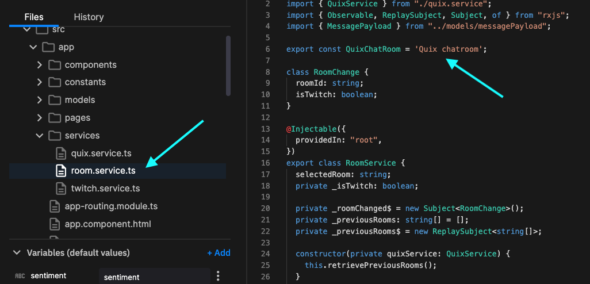
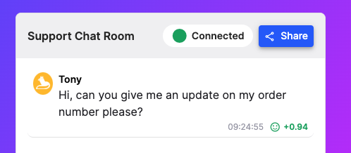
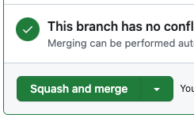

# 👩‍🔬 Lab - Customize the UI

!!! warning

    This tutorial is out of date. Please check the [tutorials overview](../overview.md) for our latest tutorials.

In this lab you use everything you've learned so far, to add a customization to the pipeline. Specifically, you change the name of the chat room in the web UI.

You develop this change on a feature branch, and then you create a PR to merge your new feature into the `tutorial` branch. 

This is a common pattern for development - you can test your new service on the feature branch, and then test again on the `tutorial` branch, before final integration into the production `main` branch.

## Create an environment

To create a new environment (and branch):

1. Click `+ New environment` to create a new environment (**note, your screen will look slightly different to the one shown here**):

    

2. Create a new environment called `Rename Chat Room`.

3. Create a new branch called `rename-chat-room`. To do this, from the branch dropdown click `+ New branch` which displays the New branch dialog.

    !!! important

        Make sure you branch from the `tutorial` branch, not `main`, as you are going to merge your changes back into the `tutorial` branch.

4. Complete creation of the environment using the default options.

5. On the projects screen, click your newly created environment, `Rename Chat Room`.

## Sync the environment

You now see that the Quix environment is out of sync with the Git repository. You need to synchronize the Quix view of the environment, with that stored in the repository. 

To synchronize Quix with the repository:

1. Click `Sync environment`:

    

    The sync environment dialog is displayed, showing you the changes that are to be made to the `quix.yaml` file, which is the configuration file that defines the pipeline.

2. Click `Sync environment`, and then `Go to pipeline`. 

    In the pipeline view, you see the services building. Ensure all services are "Running" before continuing.

## Edit the code

You are now going to edit the code for the UI to rename the chat room. To do this:

1. Click `Applications` in the left-hand navigation. Locate the UI application in the list and click on it. The code view loads.

2. Locate the file `room.service.ts` and click it. You can then change the room name to something like `Support Chat Room`:

    

3. Click `Commit` to save your changes (or use your usual Save hotkey such as Command-s).

4. Click the tag icon, and enter a tag value such as `rename-room-v1`:

    

5. Now click the `Redeploy` button on the top right of the code screen.

6. In the `Edit deployment` dialog select the tag `rename-room-v1` from the `Version tag` dropdown, and then click `Redeploy`.

At this point the redeployment will restart. You see the spinner as the service rebuilds. After some time, the service the spinner will disappear and you can test the UI again. The name of the chat room has changed:

Once you're happy with your change you can move on to merge this to the `tutorial` branch.

## Merge the feature

Once you are sure that the changes on your feature branch are tested, you can then merge your changes onto the `tutorial` branch. Here your changes undergo further tests before finally being merged into production. 

To merge your feature branch, `rename-chat-room` into `tutorial`:

1. Select `Merge request` from the menu as shown:

    

2. In the `Merge request` dialog, set the `rename-chat-room` branch to merge into the `tutorial` branch.

You are going to create a pull request, rather than perform a direct merge. This enables you to have the PR reviewed in GitHub (or other Git provider). You are also going to do a squash and merge, as much of the feature branch history is not required.

## Create the pull request

To create the pull request:

1. Click `Create pull request` in Quix. You are taken to your Git provider, in this case GitHub.

2. Click the `Pull request` button.

3. Add your description, and then click `Create pull request`.

4. Get your PR reviewed and approved. Then squash and merge the commits.

    

    You can replace the prefilled description by something more succinct. Then click `Confirm squash and merge`.

    !!! tip

        You can just merge, you don't have to squash and merge. You would then retain the complete commit history for your service while it was being developed. Squash and merge is used in this case by way of example, as the commit messages generated while the service was being developed were deemed to be not useful in this case.

## Resync the environment

You have now merged your new feature into the `tutorial` branch in the Git repository. Your Quix view in the Tutorial environment is now out of sync with the Git repository. If you click on your Tutorial environment in Quix, you'll see it is now a commit (the merge commit) behind.

You now need to make sure your Tutorial environment in Quix is synchronized with the Git repository. To do this:

1. Click on `Sync environment`. The `Sync environment` dialog is displayed.

2. Review the changes and click `Sync environment`.

3. Click `Go to pipeline`.

Your new service will build and start in the Tutorial environment, where you can now carry out further testing. When you are satisfied this feature can be released to production, then you would repeat the previous process to merge your changes to Production `main`.

## 🏃‍♀️ Next step

[Part 7 - Summary :material-arrow-right-circle:{ align=right }](summary.md)
