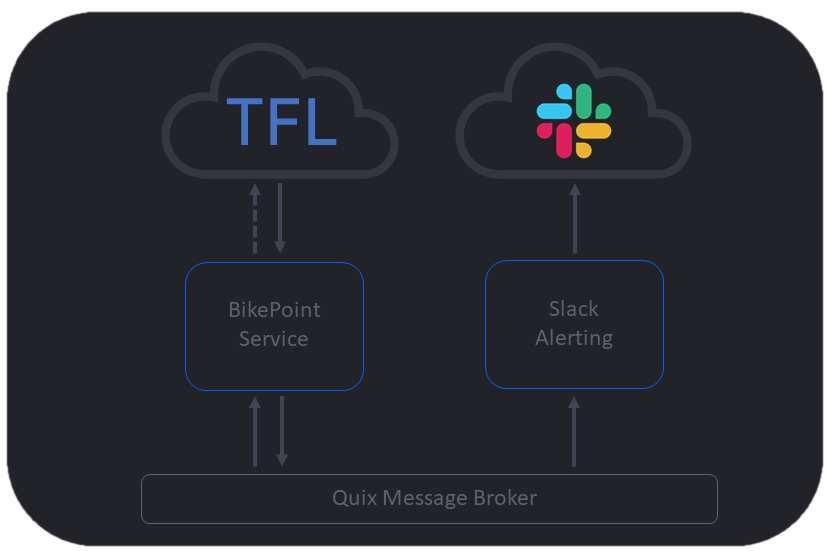
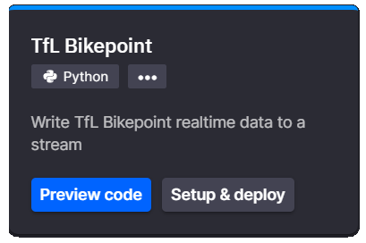
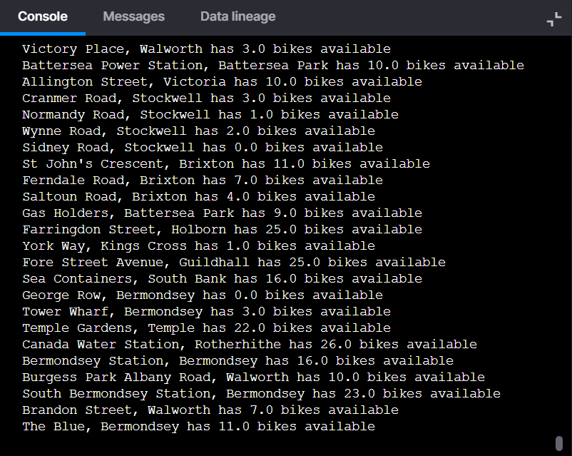
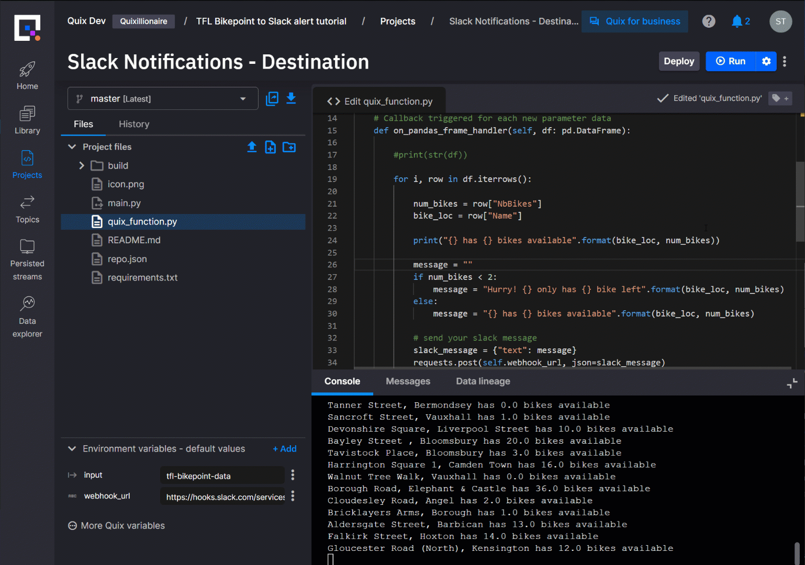

# Sending TFL BikePoint availability alerts to Slack

!!! warning

    This tutorial is out of date. Please check the [tutorials overview](../overview.md) for our latest tutorials.

## Aim

In this tutorial you will learn how to use Quix to create event driven notifications in real-time. In this example we’ll connect to the Transport for London BikePoint API and send availability alerts to Slack using Slacks Webhooks.

We will start by sending the raw BikePoint data to Slack and then we'll show you how to alter the pre-built solution to refine the Slack message.

By the end you will have:

 - Configured Slack to allow external services to send messages via WebHooks.

 - Built and deployed a Quix Service that streams data received from the TFL BikePoint API.

 - Received messages to your slack channel on the availability of bikes around London.

!!! note 
	
	If you need any help, please sign up to the [Quix Community](https://quix.io/slack-invite){target=_blank}.

## Application Architecture



The solution has 2 main elements:

 - A Quix Service to pull TFL BikePoint data.

 - A Slack Alerting Quix service.

A Quix Service receives data from the Transport For London BikePoint API and streams the data onto the Quix message broker. Another service listens to the bike data stream. When the number of available bikes at a station falls below the desired level an alert is sent to the Slack channel via the Slack Webhook.

## Prerequisites

To proceed with this tutorial you need:

 - [Free Quix account](https://portal.platform.quix.io/self-sign-up/){target=_blank}.

 - Access to Slack, you’ll need to be an admin.

 - A TFL account and API keys.

	???- info "Getting your TFL API key"

		You’ll need a free TfL account which you can register for here: [https://api-portal.tfl.gov.uk/](https://api-portal.tfl.gov.uk/){target=_blank}

		A rough guide to finding your TfL API key is as follows:

		1. Register for an account.

		2. Login and click the `Products` menu item.

		3. You should have 1 product to choose from `500 Requests per min.`

		4. Click `500 Requests per min.`

		5. Enter a name for your subscription into the box, e.g. QuixFeed, and click `Register.`

		6. You can now find your API Keys in the profile page.

!!! tip
	Check out the application's README.md later on in the tutorial if you need help creating a Slack WebHook

## Overview

This walk through covers the following steps:

1. Creating a Slack App.

2. Setup Webhooks.

3. Deploy a service to pull TFL BikePoint data.

4. Publish messages to Slack from Quix.

5. Edit the code and send a custom Slack message.

## Part one

In part one we will guide you through the process of selecting and deploying the TFL BikePoint connector and the Slack connector. 
The end result will be Slack alerts containing data from the BikePoint API.

### TFL BikePoint data

Obtaining data from TFL's BikePoint API is fairly straight forward. You need to make a request to the relevant API endpoint, passing the correct parameters and API keys. When data is returned, you'll need to process it and ensure it's in the correct format to publish to a Quix topic.

However, there is a much easier way to achieve the same outcome.

1. Navigate to the `Code Samples`.

2. Search for `TFL Bikepoint` and click the tile.

	{width=300px}

3. Click `Deploy`.

4. Paste your TFL API keys into the `tfl_primary_key` and `tfl_secondary_key` input fields.

5. Click `Deploy`.

!!! success 

	You've deployed the TFL API microservice and it is publishing data to Quix

### Configure Slack

You'll need to be an admin on Slack for this.

#### Slack App

Ensure you’re logged into the [Slack web portal](https://api.slack.com/messaging/webhooks){target=_blank} here then create a new app.

1. Click `Create your Slack app`.

2. On the popup, select `From Scratch`.

3. Enter a name and choose your environment.

4. Click `Create App`.

#### Webhooks

With the app created you'll now need to setup a webhook. This will give you a URL that you can use to publish messages to a Slack channel.

1. On the left hand menu under `Features` select the `Incoming Webhooks` menu item.

2. Switch the slider to `On` to activate incoming Webhooks.

3. Click the `Add New Webhook to Workspace` button.

4. Select the channel you want to give access to and thus publish messages to.

5. Click allow.

6. Copy the `Webhook URL` near the bottom of the page. Keep this safe you will need it soon.

### Integration

The time has come to actually connect Quix and Slack. Once again, with the help of the `Code Samples`, this is a simple task.

1. Navigate to the `Code Samples`.

2. Search for `Slack`.

3. Click `Deploy`.

4. Ensure that the `input` is set to `tfl-bikepoint-data`.

5. Past your Webhook URL into the `webhook_url` input box.

6. Click `Deploy`.

!!! success 

	You will see messages arriving in your chosen slack channel

	

## Part two

In this part of the tutorial you will replace the current Slack connector with a new connector to send customized alerts. It's based on the existing connector, so most of the work has already been done.

!!! note 
	Begin by stopping the existing Slack connector from the home page.

### Slack connector application

Follow these steps to save the connector code to your environment.

1. Navigate to the `Code Samples` and search for `Slack`.

2. Click `Preview code` on the tile.
	You can preview the code here and read the readme. You can't edit the code right now.

3. Click `Edit code`.

4. Ensure that the `input` field is set to `tfl-bikepoint-data` and past your Slack WebHook URL into the appropriate field.

5. Click `Save as Application`.
	The code is now saved to your environment and you can now edit the code and make any modifications you need.

### Customize the message

Now that you have the code saved and can edit it, you can customize the message that's sent to Slack.

1. Ensure you are viewing the file called `quix_function.py`.

2. Locate the function named `on_pandas_frame_handler`.

3. Replace the code inside the function with the following code:

	```python
	# iterate the data frame
	for i, row in df.iterrows():
		# get the number of bikes
		num_bikes = row["NbBikes"]
		# get the location
		bike_loc = row["Name"]
		# print a message
		print("{} has {} bikes available".format(bike_loc, num_bikes))
	```

4. You can now run the code here in the development environment by clicking the `Run` button near the top right of the code editor.

	!!! success

		You will see messages in the output window showing how many bikes there are at each location

		{width=350px}

5. Click the run button again to stop the code

6. Now add the following code to the function named `on_pandas_frame_handler` (Add this to the code you already added in the steps above)

	```python 
	message = ""
	# check the number of remaining bikes
	if num_bikes < 3: 
		message = "Hurry! {} only has {} bike left".format(bike_loc, num_bikes)
	else:
		message = "{} has {} bikes available".format(bike_loc, num_bikes)

	# compose and send your slack message
	slack_message = {"text": message}
	requests.post(self.webhook_url, json=slack_message)
	```

7. Repeat the process of running the code in the editor (see step 4 above)

	!!! success

		You now have customized messages in your Slack channel.

		{width=350px}

		Don't forget to stop the service before proceeding

### Deploy the service

Now that you have verified that the code works it's time to deploy it as a microservice to the Quix serverless environment.

Follow these steps:

1. Tag the code.

	???- info "This is how you tag the code"

		{width=350px}

2. Click `Deploy` near the top right corner of the code editor window.

3. On the Deploy dialog select the version tag you just created.

4. Click `Deploy`.

	The service will be built, deployed and started.

!!! success

	You modified an existing sample and deployed a microservice.

	You should start seeing Slack messages as soon as the service starts.

!!! note "Clean up"

	You can delete the `Slack Notifications - Destination` you deployed in part one of this tutorial

## What’s Next

There are many ways you can use this code, try enhancing it so it only alerts you about each location once, or once every 5 minutes.

Using Quix, coupled with something like Slack, enables for automatic real-time alerting. Quix enables you to react in real time to events or anomalies found either in raw data or generated by ML models.

If you need any help, please sign up to the [Quix Community](https://quix.io/slack-invite){target=_blank}.