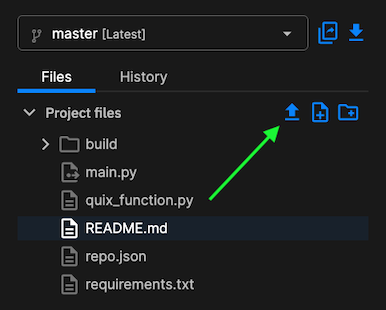
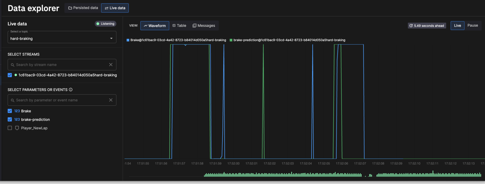

# Deploy your ML model

In this part of the tutorial, you deploy the Pickle file [containing your ML model](./train-ml.md) to Quix. Your ML code then uses this model to predict braking in real time. 


You'll also use the Quix Data Explorer to visualize the braking prediction in real time.

## Create a transform

Ensure you are logged into the Quix Portal, then follow these steps to create a transform that uses your model:

1. Click `Code Samples` in the left-hand sidebar.

2. Filter the Code Samples by selecting `Python` under `LANGUAGES` and `Transformation` under `PIPELINE STAGE`.

3. Locate the `Event Detection` item.

4. Click `Preview code` in the `Event Detection` panel. You can browse the files to ensure you have the correct sample.

5. Click `Edit code`.

6. Change the name to `Prediction Model`.

7. Ensure the input is `f1-data`.

8. Leave output as `hard-braking` (its default value).

9. Click `Save as Application`. The code  is now saved to your environment. 

	!!! tip
		
		You can see a list of applications at any time by clicking `Applications` in the left-hand navigation.

## Upload the model

Now you need to upload your ML model and edit your transform code to run the model.

1. Click on `Applications` and select `Prediction Model` to display your application code.

2. Click the `Upload File` icon at the top of the file list, as shown in the following screenshot:

	

3. Find the Pickle file containing your ML model. It's named `decision_tree_5_depth.sav` and is in the same directory as your Jupyter Notebook files.

	!!! warning

		When you click off the file, for example onto `quix_function.py`, the editor may prompt you to save the `.sav` file. **Click `Discard changes`**.
		
4. Click `quix_function.py` in the file list (remember, **do not** commit changes to the model file).

## Modify the transform code

You need to modify your transform code to work with the ML model in the Pickle file. In the file `quix_function.py`:

1. Add the following statements to import the required libraries:

	``` python
	import pickle
	import math
	```

2. In the `__init__` function add the following lines to load the model:

	``` python
	## Import ML model from file
    self.model = pickle.load(open('decision_tree_5_depth.sav', 'rb'))
	```

3. Under the `__init__` function add the following new function to preprocess the data:

	``` python
	## To get the correct output, we preprocess data before we feed them to the trained model
    def preprocess(self, df):

        signal_limits = {
            "Speed": (0, 400),
            "Steer": (-1, 1),
            "Gear": (0, 8),
            "Motion_WorldPositionX": (-math.pi, math.pi),
            "Brake": (0, 1),
        }

        def clamp(n, minn, maxn):
            return max(min(maxn, n), minn)

        for signal, limits in signal_limits.items():
            df[signal] = df[signal].map(lambda x: clamp(x, limits[0], limits[1]))

        df["Motion_WorldPositionX_sin"] = df["Motion_WorldPositionX"].map(lambda x: math.sin(x))
        df["Motion_WorldPositionX_cos"] = df["Motion_WorldPositionX"].map(lambda x: math.cos(x))

        return df
	```

4. Replace the `on_dataframe_handler` function with the following code:

	``` python
	# Callback triggered for each new parameter data.
    def on_dataframe_handler(self, stream_consumer: qx.StreamConsumer, df: pd.DataFrame):

        # if no speed column, skip this record        
        if not "Speed" in df.columns:
            return df
            
        output_df = pd.DataFrame()

        # Preprocessing
        df = self.preprocess(df)

        features = ["Motion_WorldPositionX_cos", "Motion_WorldPositionX_sin", "Steer", "Speed", "Gear"]
        X = df[features]

        # Shift data into the future by 5 seconds. (Note that time column is in nanoseconds).
        output_df["timestamp"] = df["timestamp"].apply(lambda x: int(x) + int((5 * 1000 * 1000 * 1000)))
        output_df["brake-prediction"] = self.model.predict(X)
		
        print("Prediction")
        print(output_df["brake-prediction"])		

		# Merge the original brake value into the output data frame
        output_df = pd.concat([df[["timestamp", "Brake"]], output_df]).sort_values("timestamp", ascending=True)

        self.producer_stream.timeseries.buffer.publish(output_df)  # Send filtered data to output topic
	```

5. Commit your changes to the `quix_function.py` file by clicking `Commit` or using ++ctrl+s++ or ++command+s++.

## Update the `requirements.txt` file

Click on the `requirements.txt` file and add `scikit-learn` on a new line. Commit your change.

!!! success

	You have edited the code to load and run the model.
	
## Run the code

The simplest way to run the code is to click the `Run` button in the top right-hand corner.

This will install any dependencies into a sandboxed environment and then run the code.

The output console displays the result of the prediction.

In the next few steps you deploy the code and then see a visualization of the output.

## Deploy

To deploy your transform:

1. Click `Stop` if you haven't already done so.

2. To deploy the code, click `Deploy`.

3. In the dialog that appears click `Deploy`.

Once the code has built, it is started automatically.

!!! success

	Your code is now running in a production-ready ecosystem.

## Visualize your data

To see the output of your model in real time you can use the Data Explorer. To use the Data Explorer:

1. Click the Data Explorer button on the left-hand sidebar.

2. If it's not already selected click the `Live` data tab at the top.

3. Ensure the `hard-braking` topic is selected from the `Select a topic` dropdown list.

4. Select a stream (you should only have one).

5. Select `brake-prediction` and `brake` from the parameters list.

You now see a graphical output for the prediction being output by the model as well as the actual brake value, as illustrated in the following screenshot



!!! note

	Don't forget the purpose of this tutorial was to show you how to deploy an ML model in Quix, rather than to train an accurate model. So the prediction may not always match the actual brake value.

[Conclusion and next steps :material-arrow-right-circle:{ align=right }](conclusion.md)
